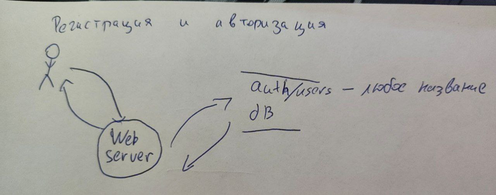
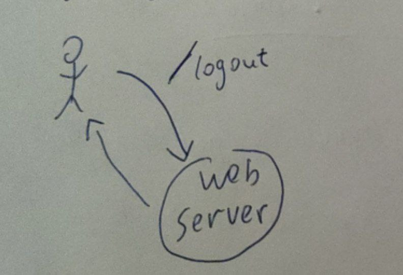
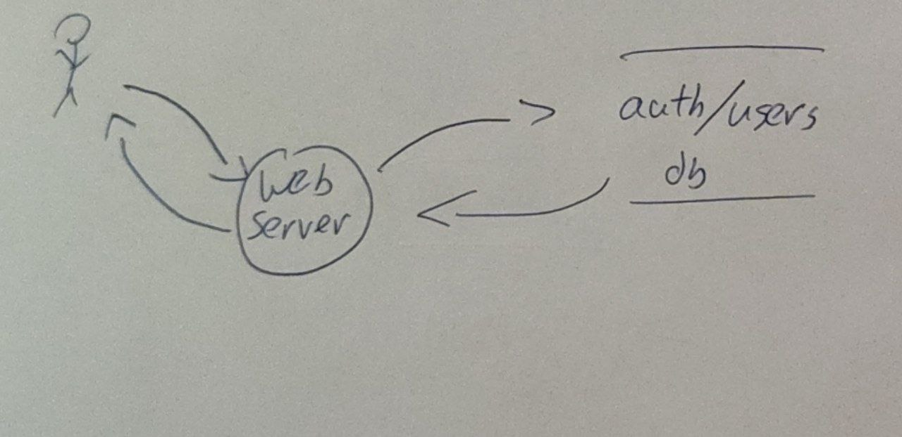
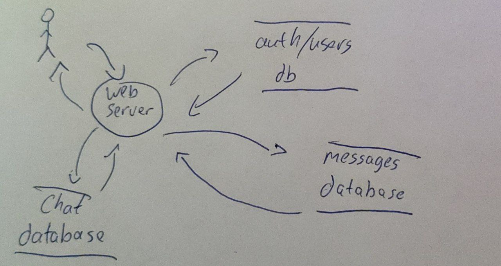
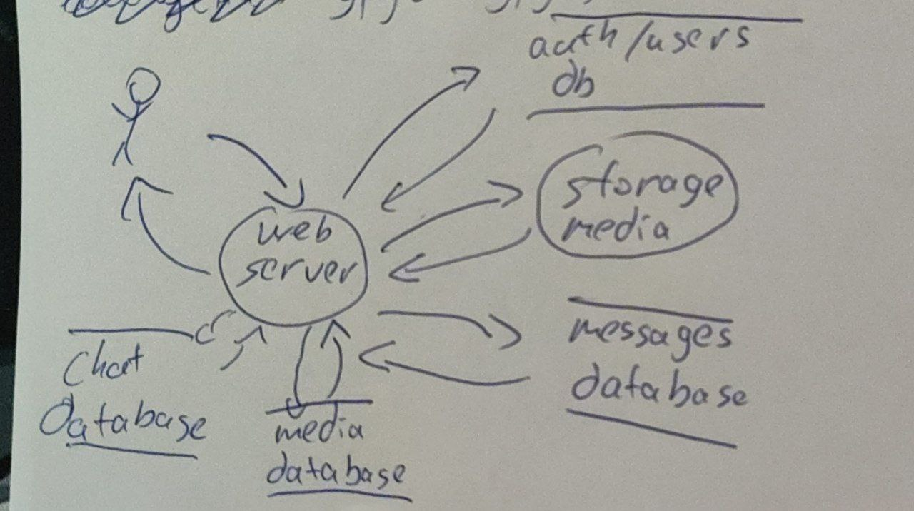

## External dependencies

| id | description |
| --- | --- |
|1|The operating System of the server, that runs the web application|
|2|The operating System of the server that runs the databases|
|3|The storage server|
|4|The database software|
|5|The cryptography of the channels used to transpher data to, from or inside the application|
|6|The device of any user|
|7|The programming language and its libraries|

## Data flow diagrams

### 1. User registration/authorization

### 2. The ability to control active sessions

### 3. The ability to find other users

### 4. The ability to send messages to each other/to a group chat

Between any number of users a chat is created. The id of the chat and its members is stored in the "Chat database". Any message 
in the chat is written to the "Messages database", with the chat id and metadata.

### 5. The ability to send files

To the previous flow of a message a "Media database" and storage server are added. The uploaded media is uploaded to the storage, with a unique id,
which is then written to the "Media database", with any important metadata.

## Trust levels

| id| Name | Description|
| -- | --| --|
|1|Guest|An unregistered user, with access only to the login\register page|
|2|User|A registered user, with access to his chats, his media, and with the ability to see all the users of the application|
|3|Admin on the web server|Has the ability to see all the users of the application, block/delete any user of his choosing|
|4|Sysadmin/techadmin|Has access and a root password to any host of the infrastructure. can start/stop any service on any machine|
|5|Database admin|Has access to the database contents (supposably the application does not encrypt sensitive data)|
|6|Application software|A program code that implements the logic of the application|
|7|Storage admin|Has access to the storage. Has rw capabilities|

## Entry and exit points

### Entry points
| id| Name | Description| Trust levels |
| -- | --| --| -- |
| 1 | Login/register page | Any user must login before sending messages | Guest (1), User(2) |
| 2 |Message function| Sending a message (with or without media, to a chat of one or multiple users)  | User (2) |
| 3 |Block/delete user account function| The ability to deny access to the application  | Admin on the web server (3) |
| 4 |Search function| The ability to search for other users  | User (2) |
| 5| Databases | The ability to execute sql commands | Database admin (5), Application software (6) |
| 6| Server code execution | The ability to execute code on the servers | Sysadmin/techadmin (4), Application software (6) |
| 7| Root server code execution | The ability to execute code on the servers from root | Sysadmin/techadmin (4)|
| 8| Storage upload| Uploading media to storage| Application software (6), Storage admin (7)|

### Exit points

| id| Name | Description| Trust levels |
| -- | --| --| -- |
| 1| Databases | Any information being stored in a database | Database admin (5), Application software (6) |
| 2| Storage | Any media being stored in a storage | Application software (6), Storage admin (7)|

## Assets
Assets represent the points of interest for an attacker. This messengers assets can be divided in four groups:
1. Database - Any information, stored in a database
2. Users - Managing user access
3. Media - Any media in the storage
4. Server - Any activity done on the server

| id| Name | Description| Trust levels |
| -- | --| --| -- |
| 1.1 | Database R | The ability to read the content of a database |Database admin (5), Application software (6) |
| 1.2 | Database W | The ability to modify (or delete) the content of a database |Database admin (5), Application software (6) |
| 2.1 | User account R | The ability to access a user account and read his secured information|Database admin (5), User (2), Storage admin(7), Application software (6) |
| 2.2 | User account W | The ability to act under the users name|User (2), Application software (6) |
| 2.3 | User account D | The ability to delete a users account|User (2), Admin on the web server (3), Application software (6) |
| 3.1 | Media read (only the media accessible to a specific user) | The ability to read the media with the access of a specific user|User (2), Storage admin (7), Application software (6) |
| 3.2 | Media write (only the media accessible to a specific user) | The ability to modify the media with the access of a specific user|User (2), Storage admin (7), Application software (6) |
| 3.3 | Media read (any media) | The ability to read any media| Storage admin (7), Application software (6) |
| 3.4 | Media read (any media) | The ability to modify any media| Storage admin (7), Application software (6)|
| 4.1 | Server code execution | The ability to execute code on the server| Sysadmin/techadmin (4), Application software (6)|
| 4.2 | Root server code execution | The ability to execute root code on the server| Sysadmin/techadmin (4)|

## Usage scenarios

1. A personal chatroom, to keep in touch with your friends and loved ones
2. A group chat of a cybersports team, to talk about future strategies and past mistakes
3. A cloud server for keeping media (using a fake account and sending to it tons of content, abusing the free storage)

## Threats

| Asset | Category | Threat | Risk| Example |
| -- | -- | -- | -- | -- |
| Database R (1.1) | Tampering | Changing the collected data| Exploitaion of other components, reputation risks|| 
| User account W (2.2) | Spoofing | Changing your username to a username of a legitimate user |Unlegitimate actions performed from a legitimate users name | My moms messenger account got hacked, I got a message from her account, asking me to follow a link and register there with my credentials, now my credentials are also compromised | 

