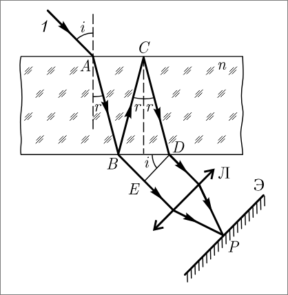

## Задачка 2
- n = 1,54
- i = $\pi/3$
- $\lambda$ = 600
Найти $d_{min}$

Трофимова страница 417
https://www.hse.ru/data/2012/04/10/1251363572/Trofimova_Zad_reschenia.pdf?ysclid=m0uvlts76j965323135

## Задачка 3
Трофимова страница 420

### Обозначения
- $c$ - скорость электромагнитных волн в вакууме
- $\nu$ - фазовая скорость электромагнитных волн в среде
- $n$ - абсолютный показатель преломления
- $i$ - угол
- $f$ - фокусное расстояние
- $R$ - радиус кривизны сферического зеркала
- $a$ - расстояние от зеркала до светящейся точки
- $b$ - расстояние от зеркала до изображения
- $L$ - Оптическая длина пути
- $s$ - Геометрическая длина пути световой волны в среде

*Абсолютный показатель преломления*
$$n = \frac c \nu$$

*Показатель преломления второй среды относительно первой (относительный показатель преломления)*
$$n_{21} = \frac{n_2}{n_1}$$

*Показатель преломления относительно углов*
$$\frac{\sin i_1}{\sin i_2} = n$$

*Закон отображения света*
$$i_1' = i_1$$

*Закон преломления света*
$$\frac{\sin i_1}{sin i_2}= n_{21}$$

*Просто запомнить*
$$\Phi = \frac1f$$

*Формула сферического зеркала*
$$\frac1f =\frac2R =\frac1a+\frac1b$$

*Формула тонкой линзы*
$$\frac1f = \frac1a +\frac1b$$

*Оптическая длина пути*
$$L = ns$$

*Оптическая разность хода*
$$\Delta=L_2-L_1$$

*Интерференционный максимум наблюдается при оптической разности хода, равной целому числу длин полуволн*

$$\Delta = m\lambda$$

*Радиус темного кольца Ньютона в отраженном свете*
$$r_m = \sqrt{m\lambda R}$$

*Оптическая сила плосковыпуклой линзы в воздухе*
$$\Phi = \frac{n-1}{R}$$

### Определения переменных

- T - период одного колебания
- $\nu$ - частота колебаний
- $\lambda$ - длина волны
- V - скорость волны
- $\Delta$ - Разность хода
- m - целое неотрицательное число
- d - расстояние между щелями в дифракционной решетке
- $\phi$ - угол между перпендикуляром от решетки до поверхности
и отклонением луча
- m - порядок максимума
- R - разрешаюшая способность
- N - число штрихов решетки

$$T = \frac{1}{\nu}$$

$$\lambda = V * T = \frac{V}{\nu}$$

Максимум яркости при интерференции:
$$\Delta = \lambda * m $$ 

Минимум яркости при интерференции:
$$\Delta = \lambda *(0,5 + m)$$

Условия максимума/минимума дифракционной решетки:
- Максимум:
$$dsin{\phi} = \pm m \lambda$$ 
- Минимум:
$$dsin{\phi} = \pm m' \frac{\lambda}{N}$$
Гдe $m' \neq 0, N, 2N, ...$ 

Радиус внешней границы *m*-ой зоны Френеля для сферической волны
$$r_m = \sqrt{\frac{ab}{a+b}m\lambda}$$ 
a и b — соответственно расстояния
диафрагмы с круглым отверстием от точечного источника и от экрана, на кото
ром дифракционная картина наблюдается.

Условия дифракционных максимумов/минимумов для одной щели,
на которую свет падает нормально
- Максимум:
$$a\sin{\phi}= \pm(2m+1)\frac{\lambda}{2}$$
- Минимум:
$$a\sin{\phi}= \pm2m\frac{\lambda}{2}$$
где а - ширина щели

