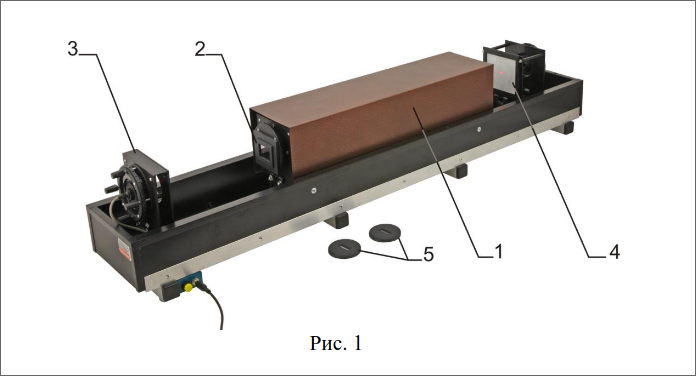
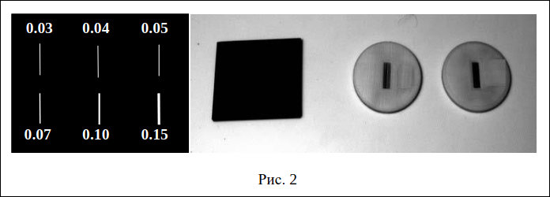
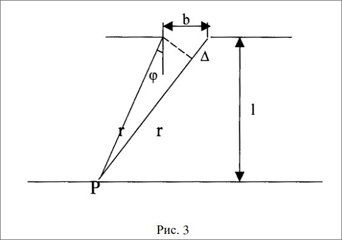
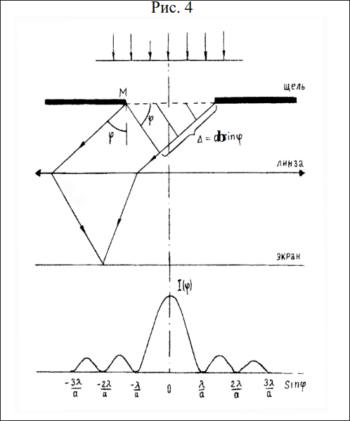
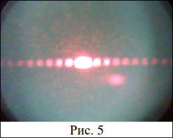
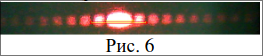

# Лабораторная работа по физике №42.1
## Исследование дифракции света на одной щели. Дифракция Фраунгофера

### 1. Цель работы
Изучение дифракции света на одной щели по схеме Фраунгофера
### 2. Задачи лабораторной работы
Наблюдение дифракционной картины на одной щели по схеме
Фраунгофера. Измерение длины волны лазерного излучения. Исследование
распределения интенсивности в дифракционной картине.
### 3. Экспериментальное оборудование, приборы и принадлежности

Лабораторная установка (рис.1) включает оптическую скамью с
светозащитным сдвигающимся кожухом 1, стойку дифракционного элемента
2 с оптической матрицей, содержащей 6 щелей различной ширины, стойку
источника света 3 со смонтированным на ней полупроводниковым лазером и
держателем линзы, стойку 4 с экраном для визуализации дифракционной
картины и веб-камерой для ее фиксации, а также две щели 5 неизвестной
ширины.
К приборам и принадлежностям относится компьютер с необходимым
программным обеспечением.
Внешний вид используемых в работе дифракционных элементов
представлен на рис. 2. Отдельно показан вид оптической матрицы

### 4. Теоретическая часть
Как всякая интерференционная картина, дифракционная картина
представляет собой череду максимумов и минимумов интенсивности волны.
Определение положения этих максимумов и минимумов – является основной
задачей качественной теории дифракции, базирующейся на принципе
Гюйгенса-Френеля.
Различают дифракцию расходящихся пучков (дифракцию Френеля,
дифракцию в ближней зоне) и дифракцию параллельных пучков (дифракция
Фраунгофера, дифракция в дальней зоне).
Установим количественный критерий, позволяющий определить, какой
вид дифракции будет иметь место в каждом конкретном случае. Найдем
разность хода лучей от краев щели шириной b до точки наблюдения Р (рис.
3). Пусть $r$ и $r+\Delta$– расстояния от P до краев щели.
Применим теорему косинусов к треугольнику со сторонами 
$r, r+\Delta$ , и $b$
$$(r+\Delta)^2 = r^2 +b^2-2rbcos(\frac{\pi}{2}+\phi)$$
Раскроем квадрат суммы и преобразуем выражение:
$$2r\Delta + \Delta^2 = b^2 +2rbsin\phi$$

Ширина щели сопоставима с длиной волны, а расстояние от щели до
точки наблюдения, как правило, много больше длины волны. Поэтому
$\Delta^2 \ll r\Delta$ и в предыдущем уравнении можно пренебречь
слагаемым $\Delta^2$. В этом приближении
$$\Delta = \frac{b^2}{2r}+b\sin\phi$$
В пределе при $r \rightarrow \infty$ получается значение разности
хода $\Delta_{\infty} = b\sin\phi$. При конечных r характер
дифракционной картины будет определяться соотношением между
разностью $\Delta - \Delta_{\infty}$ и длиной волны $\lambda$.
Для дифракции Фраунгофера
$$\Delta - \Delta_{\infty} \ll \lambda$$
При $\Delta - \Delta_{\infty}$ сравнимой с $\lambda$ будет иметь
место дифракция Френеля. Из формклы с $\sin \phi$ следует то, что
$$\Delta - \Delta_{\infty} = \frac{b^2}{2r}\sim\frac{b^2}{r}$$
Подстановка этого выражения в неравенство приводит к условию:
$$\eta =\frac{b^2}{r\lambda} \left\{ 
  \begin{array}{}
    \ll 1 &-&дифракция&Фраунгофера \\
    \sim 1 &-&дифракция&Френеля \\ 
    \gg 1 &-& геометрическая &оптика
  \end{array}
\right.$$
Параметр дифракции $\eta$, равный по порядку величины квадрату
отношения размера отверстия к радиусу первой зоны Френеля - 
показывает с каким видом дифракции мы имее дело: если
$\eta \ll 1$ - то с дифракцией Фраунгофера, если $\eta \sim 1$ - 
дифракцией Френеля. Если $\eta \gg 1$, то дифракция не наблядается,
и в этом случае соблюдаются законы геометрической оптики, т.е свет
не проникает в область геометрической тени. 
Между дифракцией Френеля и дифракцией Фраунгофера нет
принципиальной разницы, одна непрерывно переходит в другую. Для
практического осуществления дифракции Фраунгофера точечный источник
света помещают в фокус собирающей линзы. В этом случае после
преломления в линзе получается параллельный пучок света (применение
лазера в качестве источника света позволяет обойтись без линзы). Этот пучок
дифрагирует на каком-либо препятствии. Дифракционная картина
наблюдается в фокальной плоскости линзы, поставленной на пути
дифрагированного света.

Дифракция света ограничивает разрешающую способность
спектральных и зрительных приборов. В результате дифракции каждая
спектральная линия в спектральном приборе представляется серией
максимумов определенной ширины, и, чтобы прибор мог различить
(«разрешить») две спектральные линии, необходимо, чтобы
соответствующие им максимумы не сливались в один.

#### Дифракция на одной щели
Пусть плоская монохроматическая волна падает нормально на плоский
бесконечный экран, в котором прорезана узкая щель шириной b.
Точки волнового фронта, достигшего щели, рассматривают как источники
когерентных сферических волн. Результат их интерференции в направлении,
составлявшем угол $\phi$ с нормалью к экрану, определяется 
величиной разности хода $\Delta$ волн, идущих от противоположных
краев щели: 
$$\Delta = b \sin\phi$$
Разобьем цель на так называемые зоны Шустера (аналог зон Френеля)
имеющие вид полос, параллельных ребру *М* щели. Ширина каждой
зоны выбирается так, чтобы разность хода от краев этих зон была
равна $\frac{\lambda}{2}$, т.е. для точки, находящейся под углом
$\phi$ всего на ширине щели уместится
$$n_ш = \left[\frac{\Delta}{\frac{\lambda}{2}}\right] = 
\left[ \frac{2b\sin\phi}{\lambda}\right]$$
полных зон (квадратные скобки обозначают целую часть числа). Площади
зон Шустера медленно убывают с номером зоны.

Из выражения (5) вытекает, что число зон Шустера на ширине щели
зависит от угла $\phi$. В силу построения для каждой волны, идущей из
произвольной зоны, найдется волна из соседней зоны, приходящая в точку
наблюдения в противофазе. Таким образом, при четном числе зон Шустера в
направлении наблюдения интенсивность минимальна. При нечетном $n_ш$
действие одной из зон остается нескомпенсированным, приводя к тому, что в
этом направлении наблюдается максимум.
Следовательно, если выполняется условие
$$b \sin \phi = \pm m \lambda $$
При $m = 1, 2, 3, ...$, то в точке наблюдения имеет место
дифракционный минимум. Натуральное число *m* называется порядком
минимума. Если же число зон Шустера нечетное
$$b\sin\phi = \pm (2m+1)\frac{\lambda}{2}$$
При $m = 1, 2, 3, ...$, то наблядется дифракционный максимум.
Натуральное число *m* называется порядком максимума.

При малых углах $\phi$ открыта только часть первой зоны Шустера,
поэтому в центре дифракционной картины наблюдается широкий центральный
максимум (максимум нулевого порядка).

Расчеты показывают, что в случае дифракции на одной щели центральный
максимум значительно превосходит по интенсивности остальные 
максимумы: в нем сосредотачивается основаная доля светового
потока, проходяшего через щель. Имеет место следующее соотношение
для интенсивностей дифракционных максимумов для различного порядка:
$$I_0:I_1:I_2:I_3:...=1:0,045:0,016:0,008:...$$
Из ранее выведенных формул следует, что угловое расстояние между
максимумами и минимумами при дифракции на щели $\Delta \phi_щ 
\sim \frac{\lambda}{\alpha}$, и большим $\lambda$ соответствуют
большие углы отклонения. 

Если считать угол $\phi$ малым, можно заменить $\sin\phi \approx 
\tg \phi = \frac {2a}{2L}$, где *L* - расстояние между щелью и 
экраном, *2а* - расстояние между минимумами одного порядка на 
экране, тогда одна из предыдущих формул приобретет вид:
$$b\frac{(2a)}{2L} = \pm m\lambda$$
откуда можно найти длину волны излучения: 
$$\lambda=\frac{(2a)b}{2L*m}$$
Если требуется определить ширину щели при известной длине волны
светового излучения, то формулу можно преобразовать так:
$$b = m\lambda\frac{2L}{(2a)}$$

### 5. Порядок проведения лабораторной работы
Внимание! Запрещается трогать руками оптические поверхности линзы,
источника и экран. Все перемещения вдоль оптической скамьи следует
производить, двигая приборы за металлические рейтеры
1. Подключите веб-камеру, присоединив ее кабель к USB–входу компьютера.
2. После включения компьютера запустите программу «Практикум по общей
физике». В открывшемся окне с предупреждением об отсутствии
измерительного устройства нажмите «OK». На панели устройств выберите
соответствующий сценарий проведения эксперимента (Alt+C) . В окне
«Устройство видеозахвата» выберете «USB Camera».
3. В окне «Устройство видеозахвата» нажмите кнопку . После этого в окне
настройки выберите разрешение 640х480 и нажмите «ОК».
4. Проверьте расположение стоек на оптической скамье. Стойка источника
света и стойка с экраном должны быть около противоположных концов
оптической скамьи, стойка дифракционного элемента должна быть около
отметки «25см».
5. Включите питание лазера и пропустите его луч через отверстие
металлического диска, установленного на стойке дифракционного
элемента (дифракционный элемент должен быть предварительно снят)
таким образом, чтобы он попал в центр экрана. Изменение направления
луча осуществляется вращением юстировочных винтов на оправке лазера.
Вкручивая юстировочный винт по резьбе, обратите внимание на то, что
диаметрально противоположный винт при этом не должен касаться
упорного кольца оправки.
6. Установите на стойку осветителя рассеивающую линзу и, сдвигая ее на
магнитных полосах, добейтесь того, чтобы расширенный лазерный луч
освещал весь экран. Закройте экран от внешнего света светозащитным
сдвигающимся кожухом.
7. Получите на экране компьютера освещенный круг. Если изображение
экрана в кадре не достаточно чёткое, подрегулируйте фокусировку камеры,
вращая её объектив.
8. Сохраните изображение в файл, нажав экранную кнопку « » в верхней
строке окна «Устройство видеозахвата». Согласитесь с предложенной
программой папкой для записи изображений или укажите папку
самостоятельно.
9. Используя цифровой инструмент «окружность» (кнопка в строке над
таблицей) постройте окружность, совпадающую с границей освещенной
области экрана. Для этого сначала подведите указатель мыши к
предполагаемому центру окружности и щелкните левой клавишей. После
этого «растягивайте» радиус окружности, снова нажав на левую клавишу
мыши. После построения окружности, примерно совпадающей с
изображением кромки оправки, подстройте ее положение (захват мышью
за любую точку окружности) и радиус (захват центра или точки, в которой
оканчивается видимый на экране радиус окружности).
10. Захватите указателем мыши один из концов масштабного отрезка
(небольшой отрезок зеленого цвета в левом верхнем углу окна с
фотографией ) и поместите его на построенную окружность.
Аналогичным образом поместите второй конец масштабного отрезка в
диаметрально противоположную точку окружности, при этом,
естественно, масштабный отрезок должен пройти через ее центр. Нажмите
кнопку ввода масштаба , и в открывшемся диалоговом окне введите
видимый диаметр сфотографированной окружности, составляющий 46 мм.
11. Снимите линзу со стойки осветителя и установите матрицу с щелями на
стойку так чтобы лазерный луч падал на самую широкую щель.
Поворачивая оправку, на которой установлена матрица, добейтесь
появления на экране горизонтально расположенной дифракционной картины (рис. 5). Измерьте расстояние L между щелью и экраном и
запишите полученное значение в Таблицу 1.

12. Сфотографируйте веб-камерой дифракционную картину и определите
расстояния между минимумами первого и второго порядка. Для этого
перейдите на вкладку «Камера» и запишите изображение в файл ( ). На
вопрос программы о сохранении положения осей координат и масштабного
отрезка здесь и далее следует отвечать положительно.
13. Перенесите масштабный отрезок на участок фотографии, свободный от
дифракционной картины. Для этого следует захватить его указателем мыши
(левая кнопка) за любую внутреннюю точку. Нельзя захватывать концы
масштабного отрезка, т.к. это приведет к изменению его длины и
необходимости повторения процедуры ввода масштаба.
14. В правом окне регистрации данных на панели инструментов выберите
инструмент «Добавление отрезка к изображению» ( ) и зафиксируйте его
кнопкой . Последовательно совместите концы отрезков с симметрично
расположенными дифракционными минимумами первого и второго порядка
на изображении. Установка и перемещение концов отрезка осуществляется с
помощью левой клавиши мыши (рис. 6)

15. Перенесите в Таблицу 1 значения длин отрезков из 8-го столбца таблицы
на экране.
16. Повторите действия, описанные в пунктах 14 и 15, последовательно
переходя к щелям меньшей ширины. При уменьшении ширины щели можно
уменьшить расстояние между щелью и экраном так, чтобы вторые
минимумы были в пределах рабочей части экрана (рекомендуется подвинуть
экран к центру скамьи, прикладывая усилие к нижней части его стоек). Новое
значение расстояния L следует внести в Таблицу 1.
17. Используя формулу (9), рассчитайте значения длины волны излучения на
основе данных по каждой щели (среднее значение по двум парам
минимумов), после чего найдите среднее значение длины волны на основе
всех данных эксперимента. При расчете используйте точные значения
ширины щели, приведенные в таблице.

Таблица 1:

|$i$|$L,mm$|$b,mm$|$2a_1,mm$|$2a_2,mm$|$\lambda_{i1}$|$\lambda_{i2}$| $\lambda_{i}$|$<\lambda >$ |
|:--:|--|--|--|--|--|--|--|--|
|1|600|0.03|22,7|45,3|567|566|566,5||
|2|600|0.04|17,71|34,52|590|575|582,5||
|3|600|0.05|14,55|29,44|606|610|608||
|4|600|0.07|10,64|21,12|620|616|618||
|5|600|0.10|7,5696|14,8|630|616|623||
|6|600 |0.15|5,1573|9,7324|645|608|626,5|604|

$$\lambda=\frac{(2a)b}{2L*m}$$

- i - номер измерения
- L - расстояние от щели до экрана
- b - ширина щели
- $2a_1$ - расстояние между первыми минимумами
- $2a_2$ - расстояние между вторыми минимумами
- $\lambda_{i1}$ - длина волны
- $\lambda_{i2}$ - длина волны
- $\lambda_{i}$ - средняя длина волны, расчитанная по двум парам минимумов
- $<\lambda>$ - средняя длина волны

18. Верните экран в наиболее удаленное от стойки дифракционного элемента
положение. Установите оправку №1 со щелью неизвестной ширины,
сфотографируйте дифракционную картину и проведите обработку
фотографии. Результаты запишите в Таблицу 2.
19. Аналогичные измерения выполните для второй щели неизвестной
ширины. Результаты запишите в табл.2.
20. Используя формулу (10) и среднее значение длины волны излучения из
Таблицы 1, определите ширины оптических щелей №1 и №2. Результат
запишите в Таблицу 2.

Таблица 2:

|j|$2a_1$|$2a_2$|$b_j$|b|
|--|--|--|--|--|
|1 |12,72|25,2| 0,28/0,28| 0,28|
|2 |7,82|15,47| 0,47/0,48 |0,47|

$$b=m\lambda\frac{2L}{(2a)}$$
- j - номер щели
- $2a_1$,мм - расстояние между первыми двумя минимумами
- $2a_2$,мм -  расстояние между вторыми двумя минимумами
- $b_j$,мм - ширина щели
- $b$,мм - средняя ширина щели

#### Вывод
Полученные в результате вычислений и эксперимента длины волн находятся
в спектре близко к красному. Из чего можно сделать вывод, что
выведенная для эксперимента формула верна

### 6. Контрольные вопросы

1. Определение дифракции: 

    Дифракция — это явление отклонения 
    волн от прямолинейного распространения при прохождении через 
    отверстия, щели или при встрече с препятствиями. Это приводит к
    изменению формы волнового фронта и возникновению новых направлений
    распространения волн.
2. Плоские и сферические волны:
   - Плоские волны — это волны, у которых фронт волны 
   представляет собой плоскость. В таких волнах все точки на 
   волновом фронте колеблются в одинаковой фазе, и волновые лучи 
   идут параллельно друг другу.
   - Сферические волны — это волны, у которых фронт волны имеет 
   форму сферы. Такие волны распространяются из одной точки
   (источника), и их амплитуда уменьшается с увеличением расстояния от источника.
3. Принцип Гюйгенса: Каждый точечный элемент волнового фронта можно рассматривать как источник вторичных сферических волн, 
распространяющихся со скоростью исходной волны. Новый волновой фронт в любой момент времени является огибающей этих вторичных волн.
4. Различие между дифракцией Френеля и Фраунгофера:
   - Дифракция Френеля — наблюдается, когда источник света и 
   наблюдатель находятся на конечных расстояниях от дифракционного
   препятствия.В этом случае волновой фронт изогнутый.
   - Дифракция Фраунгофера — наблюдается, когда источник света и
   наблюдатель находятся на бесконечно удаленных расстояниях от
   дифракционного препятствия (или в фокусах линз). В этом случае
   волновой фронт плоский, и картину дифракции можно рассматривать
   на экране или в фокальной плоскости линзы.

   Тип дифракции, наблюдаемый в работе — это, как правило, 
   дифракция Фраунгофера, поскольку условия проведения опытов 
   обычно предполагают использование линз для получения плоского 
   волнового фронта.

5. Схема наблюдения дифракции Фраунгофера: Для наблюдения
дифракции Фраунгофера обычно используют параллельный световой 
пучок, который формируется с помощью лазера и линз. Свет падает 
на препятствие или щель, а затем после прохождения через него 
собирается на экране или в фокальной плоскости линзы, где и
наблюдается дифракционная картина.

6. Минимумы при дифракции на щели: Минимумы возникают из-за 
интерференции волн, которые приходят из разных частей щели и 
интерферируют друг с другом в противофазе. В результате 
происходит частичное или полное гашение волн, что приводит к 
появлению темных полос в дифракционной картине.

7. Углы наблюдения дифракционных минимумов и максимумов: 
Дифракционные минимумы и максимумы наблюдаются под углами, 
которые определяются условиями интерференции. Для щели минимумы
происходят при углах, удовлетворяющих условию 
$d \sin \theta = m \lambda$ , где d — ширина щели, $\lambda$ — 
длина волны, $m$ — порядок минимума $m = \pm 1, \pm 2, ...$ 
Максимумы не одинаковой ширины, и их интенсивность также 
уменьшается с увеличением угла.

8. Порядок проведения работы:
   - Подготовить оптическую установку с лазером и линзами для 
   формирования параллельного пучка.
   - Установить препятствие (щель) на пути светового пучка.
   - Использовать линзу для фокусировки полученного светового 
   пучка на экран.
   - Наблюдать дифракционную картину на экране и провести 
   измерения углов, под которыми видны минимумы и максимумы.
   - Записать результаты измерений и провести их анализ для 
   определения параметров дифракции.

