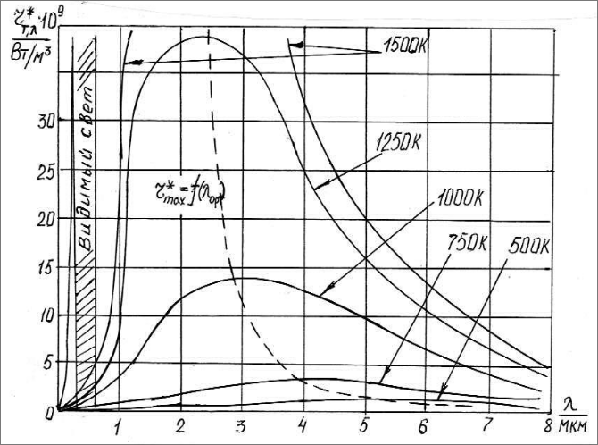
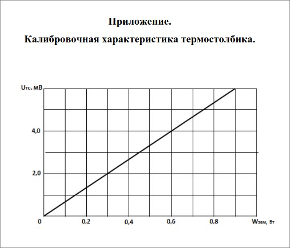

# Лабораторная работа № 45

## Изучение законов теплового излучения

### Цель работы:
Исследование зависимости энергетической светимости термостолбика
от температуры. Оценка постоянной Стефана – Больцмана. Исследование закона смещения Вина.

---

## Теоретическое описание

### Тепловое излучение

Поток световой энергии, падающий на поверхность непрозрачного
тела, частично отражается, а частично поглощается. Поглощаемая
энергия преобразуется в иные формы энергии, чаще всего
в энергию теплового движения. Поэтому тела, поглощающие
лучи, нагреваются. Тело, нагретое до температуры большей
, чем температура окружающей среды, отдает теплоту в
виде излучения электромагнитных волн (непрерывный спектр
). Такое излучение называется тепловым (температурным
). Таким образом, тепловое равновесное излучение осуществляется
за счет энергии хаотического движения частиц тела.

Обозначим через энергетическую светимость количество
энергии, излучаемой единицей поверхности тела в одну
секунду по всем длинам волн (иначе эта величина называется
еще интегральной плотностью излучения, интегральная энергетическая
светимость):
$$
R_T = \frac{dE_{\text{изл}}}{dS \cdot dt} = \frac{dW}{dS}
$$

где $E_{\text{изл}}$ — полная энергия, излучаемая телом
, $S$ – площадь излучающей поверхности, $t$ – время,
$W$ – мощность излучения, размерность $[R_T] = \text
{Дж}/\text{м}^2 \cdot \text{с} = \text{Вт}/\text{м}^2$.

Измерения показывают, что энергия излучения распределяется
неравномерно между всеми длинами волн, которые испускаются
нагретыми телами. Энергия, излучаемая в единицу времени
единицей поверхности тела в единичном интервале длин
волн, называется монохроматической (дифференциальной
) плотностью излучения или иначе спектральной плотностью
энергетической светимости:
$$
R_{T,\lambda} = \frac{dE_{\text{изл},\lambda}}{dS \cdot dt \cdot d\lambda}
$$

Из определения вытекает связь между светимостью и излучательной
способностью тела:
$$
R_T = \int_{0}^{\infty} R_{T,\lambda} \, d\lambda
$$

При падении на поверхность какого-либо тела лучистого
потока наблюдается поглощение, отражение и пропускание
энергии. Величина, равная отношению энергии поглощенного
света к энергии падающего, называется коэффициентом поглощения
или поглощающей способностью тела:
$$
\alpha_\lambda = \frac{E_{\text{погл}}}{E_{\text{пад}}}
$$

Величина, равная отношению энергии отражённого света
к энергии падающего, называется коэффициентом отражения
или отражательной способностью тела. Коэффициент безразмерный
и показывает, какую долю падающего излучения в интервале
длин волн $\Delta\lambda$ тело отражает:
$$
\rho_\lambda = \frac{E_{\text{отр}}}{E_{\text{пад}}}
$$

Величина, равная отношению энергии света, прошедшего
через данное тело (среду) ко всей падающей энергии, называется
коэффициентом пропускания:
$$
\tau_\lambda = \frac{E_{\text{проп}}}{E_{\text{пад}}}
$$

Коэффициент пропускания характеризует прозрачность тела
по отношению к падающему излучению. Измерения показывают
, что коэффициенты поглощения, пропускания и отражения
тела зависят не только от длины волны падающего излучения
, но и от температуры тела, то есть:
$$
\alpha_\lambda = f(\lambda, T), \quad \tau_\lambda = f(\lambda, T), \quad \rho_\lambda = f(\lambda, T)
$$

Для монохроматического излучения они называются спектральными
коэффициентами поглощения, пропускания и отражения и
обозначаются $\alpha_{\lambda, T}, \tau_{\lambda, T},
\rho_{\lambda, T}$.

---

### Абсолютно черное тело

Тело, у которого $\alpha_{\lambda, T} = 1$ для всех длин
волн, называется абсолютно черным. Если спектральная
поглощательная способность тела в некоторой области длин
волн постоянна ($\alpha_{\lambda, T} < 1$), тело в этой
области спектра считается серым. Абсолютно черное тело
(АЧТ) (точнее, абсолютно поглощающее) полностью поглощает
все падающие на него излучения любой длины волны при
любой температуре.

Коэффициент поглощения АЧТ для всех длин волн при любых
температурах равен единице, а коэффициент отражения равен нулю.

---

### Закон Кирхгофа

Спектральные лучеиспускательная и поглощательная способности
любого тела связаны законом Кирхгофа:  
Отношение спектральной плотности энергетической светимости
к спектральной поглощательной способности не зависит
от природы тела:
$$
\frac{R_{\lambda, T}}{\alpha_{\lambda, T}} = u_{\lambda, T}
$$
где $u_{\lambda, T}$ — универсальная функция Кирхгофа.

---

### Закон Планка

На основании гипотезы о квантовой природе излучения Планк
показал, что:
$$
u_{\lambda, T} = \frac{2hc^2}{\lambda^5} \cdot \frac{1}{e^{\frac{hc}{\lambda k T}} - 1}
$$

---

### Закон Стефана-Больцмана

Полная энергия, излучаемая абсолютно черным телом, пропорциональна
четвертой степени абсолютной температуры:
$$
R_T = \sigma T^4
$$

где $\sigma = 5.669 \cdot 10^{-8} \, \text{Дж}/(\text{м}^2 \cdot \text{с} \cdot \text{К}^4)$ — постоянная Стефана-Больцмана.
### Закон смещения Вина

Длина волны, на которую приходится максимум интенсивности
излучения, обратно пропорциональна температуре:
$$
\lambda_{\text{max}} = \frac{b}{T}
$$
где $b = 2.898 \cdot 10^{-3} \, \text{м} \cdot {\text
К}$ — постоянная смещения Вина.

### Устройство и принцип работы установки

Установка состоит из:
1. **Объекта исследования (печь)** — модель абсолютно
черного тела, выполненная в виде закрытой термоизолированной
электропечи с отверстием. Она включает нагревательное
устройство, встроенный термопарный датчик температуры
, регулируемый источник питания и вентиляторы для охлаждения.
2. **Устройства измерительного** — содержит аналого-
цифровые преобразователи, измеряющие и отображающие температуру
печи и термо-ЭДС термостолбика.
3. **Термостолбика** — датчика потока излучения с батареей
термопар, встроенным нагревательным элементом для калибровки
и защитной слюдяной пластиной.

Принцип работы:
- Температура в печи измеряется термопарой.
- Излучение, выходящее из отверстия печи, фиксируется термостолбиком.
- Снятые данные используются для вычисления параметров
теплового излучения.

---

### Порядок проведения работы

1. Установить термостолбик так, чтобы втулка на его панели
вошла в отверстие на панели печи. Расстояние между излучателем
($S_{\text{изл}} = 7.854 \cdot 10^{-5} \, \text{м}^2
$) и приемником ($S_{\text{пр}} = 1.12 \cdot 10^{-5}
\, \text{м}^2$) должно быть $L = 0.045 - 0.050 \, \text{м}$.
2. Подключить сетевые шнуры объекта исследования и измерительного
устройства к сети, включить устройство измерительное
и дать прогреться 5 минут.
3. Включить печь, установить регулятор мощности нагрева
на минимум, а затем начать нагрев. Постепенно увеличивать
мощность, записывая значения напряжения термостолбика
и температуры печи через каждые 100°C до 700°C.
4. Записать полученные данные в таблицу.
5. Остановить нагрев, выключить печь и включить вентиляторы
для охлаждения.
6. На основе графика зависимости напряжения термостолбика
от мощности замещения вычислить мощность и оценить постоянную
Стефана-Больцмана.

---

### Контрольные вопросы

1. **Что такое тепловое излучение?**

   Тепловое излучение — это электромагнитное излучение,
   испускаемое телом в результате его температуры. Оно возникает
   из-за теплового движения заряженных частиц внутри вещества
   и присутствует во всем диапазоне электромагнитного спектра.

2. **Что такое равновесность излучения и почему тепловое
излучение является равновесным?**

   Равновесное излучение — это излучение, находящееся в
   термодинамическом равновесии с окружающей средой. В этом
   состоянии количество энергии, поглощаемой телом, равно
   количеству энергии, излучаемой им. Тепловое излучение
   является равновесным, потому что оно возникает при установившемся
   балансе между поглощением и испусканием энергии телом
   при данной температуре.

3. **Почему тепловое излучение относится к квантово-
оптическим явлениям?**

   Тепловое излучение относится к квантово-оптическим явлениям
   , потому что его свойства нельзя полностью объяснить
   классической физикой. Для точного описания теплового
   излучения необходимо учитывать квантование энергии, введенное
   Планком, что приводит к пониманию излучения в терминах
   фотонов с дискретными энергиями.

4. **Дайте определение основным энергетическим величинам
теплового излучения: поток излучения, спектральная плотность
, энергетическая светимость тела.**

   - **Поток излучения ($\Phi$):** полная энергия, излучаемая
   телом за единицу времени. Определяется как:

     $$
     \Phi = \frac{dQ}{dt},
     $$

     где $dQ$ — излученная энергия за время $dt$.

   - **Спектральная плотность ($\rho(\nu)$ или $\rho(\lambda
   )$):** распределение энергии излучения по частотам $\
   nu$ или длинам волн $\lambda$. Она показывает, сколько
   энергии излучается в единичном диапазоне частот или длин волн.

   - **Энергетическая светимость тела ($R$):** мощность
   излучения на единицу площади поверхности тела. Выражается как:

     $$
     R = \frac{d\Phi}{dS},
     $$

     где $dS$ — элемент площади поверхности.

5. **Что называется коэффициентами поглощения, отражения и пропускания?**

   - **Коэффициент поглощения ($\alpha$):** доля падающего
   излучения, которая поглощается материалом.

   - **Коэффициент отражения ($\rho$):** доля падающего
   излучения, которая отражается от поверхности материала.

   - **Коэффициент пропускания ($\tau$):** доля падающего
   излучения, которая проходит через материал.

   Эти коэффициенты связаны соотношением:

   $$
   \alpha + \rho + \tau = 1.
   $$

6. **Какое тело называется абсолютно черным? Какова физическая
модель абсолютно черного тела?**

   **Абсолютно черное тело** — это идеализированный объект
   , который полностью поглощает все падающее на него электромагнитное
   излучение независимо от частоты и угла падения. Физическая
   модель такого тела представляет собой полость с небольшим
   отверстием: излучение, попадающее внутрь через отверстие
   , многократно отражается от внутренних стенок и практически
   не выходит обратно, что обеспечивает полное поглощение.

7. **Дайте определения основным законам теплового излучения
: закону Кирхгофа, закону Стефана-Больцмана, закону смещения
Вина.**

   - **Закон Кирхгофа:** отношение излучательной способности
   тела $E(\nu, T)$ к его коэффициенту поглощения $\alpha
   (\nu, T)$ при данной частоте $\nu$ и температуре $T$
   является универсальной функцией (излучательной способностью
   абсолютно черного тела $E_0(\nu, T)$):

     $$
     \frac{E(\nu, T)}{\alpha(\nu, T)} = E_0(\nu, T).
     $$

   - **Закон Стефана-Больцмана:** полная энергетическая
   светимость абсолютно черного тела пропорциональна четвёртой
   степени его абсолютной температуры:

     $$
     R = \sigma T^4,
     $$

     где $\sigma$ — постоянная Стефана-Больцмана.

   - **Закон смещения Вина:** длина волны $\lambda_{\text
   {max}}$, на которой спектральная плотность излучения
   достигает максимума, обратно пропорциональна температуре:

     $$
     \lambda_{\text{max}} T = b,
     $$

     где $b$ — постоянная смещения Вина.

8. **Что такое фотоны? Как гипотеза Планка позволяет
объяснить основные законы теплового излучения?**

   **Фотоны** — это кванты электромагнитного излучения,
   элементарные частицы света, несущие энергию, пропорциональную
   частоте излучения:

   $$
   E = h \nu,
   $$

   где $h$ — постоянная Планка, $\nu$ — частота.

   **Гипотеза Планка** вводит понятие квантования энергии
   осцилляторов: энергия может принимать только дискретные
   значения, кратные $h \nu$. Это позволило Планку вывести
   закон распределения энергии в спектре излучения абсолютно
   черного тела, объяснив экспериментальные наблюдения и
   установив фундаментальные законы теплового излучения.

9. **Объясните принцип работы экспериментальной установки.**

    Установка состоит из:
    1. **Печи** — модели абсолютно черного тела с контролируемой
    температурой.
    2. **Термостолбика** — датчика потока излучения, измеряющего
    энергию излучения.
    3. **Измерительного устройства** — фиксирующего значения
    температуры печи и термо-ЭДС.

    Температура измеряется термопарой, излучение — термостолбиком
    . На основе этих данных изучается зависимость светимости
    от температуры.

| № измерения | t, °C |$U_{тс}, мВ$| $W_{зам}, Вт$ | T, К  | $\sigma = \frac{W}{ST^4}, \frac{Дж}{(м^2·с·К^4)}$|
|-------------|-------|---------|----------|-------|--------------------------|
| 1   | 100   | 0.10    | 0,015    | 373   | $7.06 \cdot 10^{-8}$                      |
| 2   | 200   | 0.19    | 0,027    | 473   | $4.9 \cdot 10^{-8}$                      |
| 3   | 300   | 0.35    | 0,0615   | 573   | $5.22 \cdot 10^{-8}$                      |
| 4   | 400   | 0.74    | 0,111    | 673   | $4.83 \cdot 10^{-8}$                     |
| 5   | 450   | 1.09    | 0,1635   | 723   | $5.5 \cdot 10^{-8}$                      |
| 6   | 500   | 1.46    | 0,219    | 773   | $5.51 \cdot 10^{-8}$                      |
| 7   | 550   | 1.80    | 0,270    | 823   | $5.45 \cdot 10^{-8}$                      |
| 8   | 600   | 2.28    | 0,342    | 873   | $5.28 \cdot 10^{-8}$                      |
| 9   | 650   | 2.90    | 0,435    | 923   | $5.45 \cdot 10^{-8}$                      |
| 10  | 700   | 3.46    | 0,519    | 973   | $5.19 \cdot 10^{-8}$                      |

$$<\sigma>=5.44\cdot10^{-8} \\ \sigma=5.67\cdot 10^{-8} \\
\Delta\sigma=\frac{\sigma-<\sigma>}{sigma}=\frac{5.67-5.44}{5.67}\approx0.04
$$
