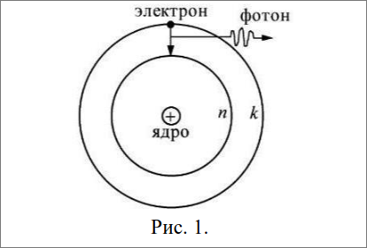
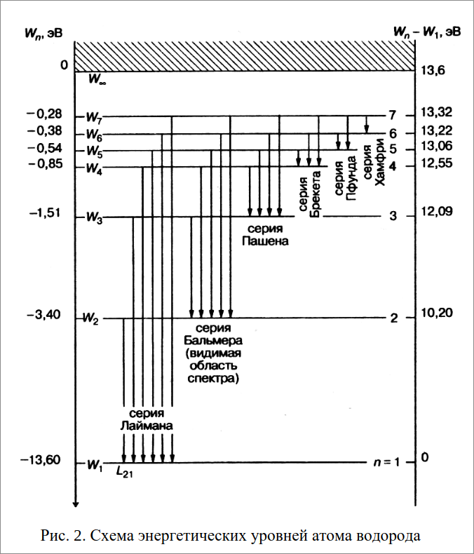
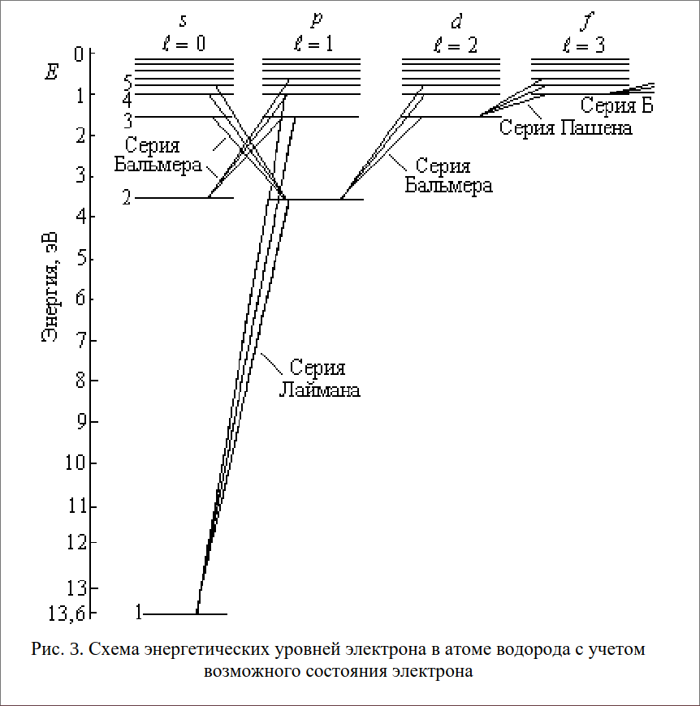
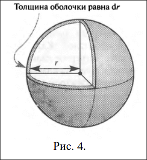
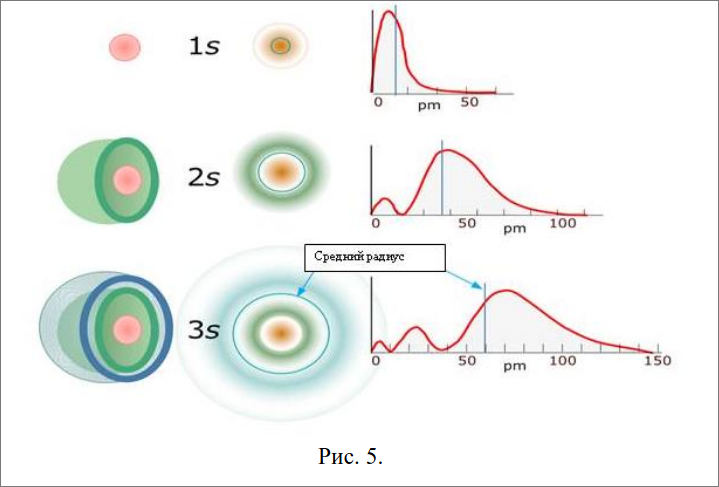
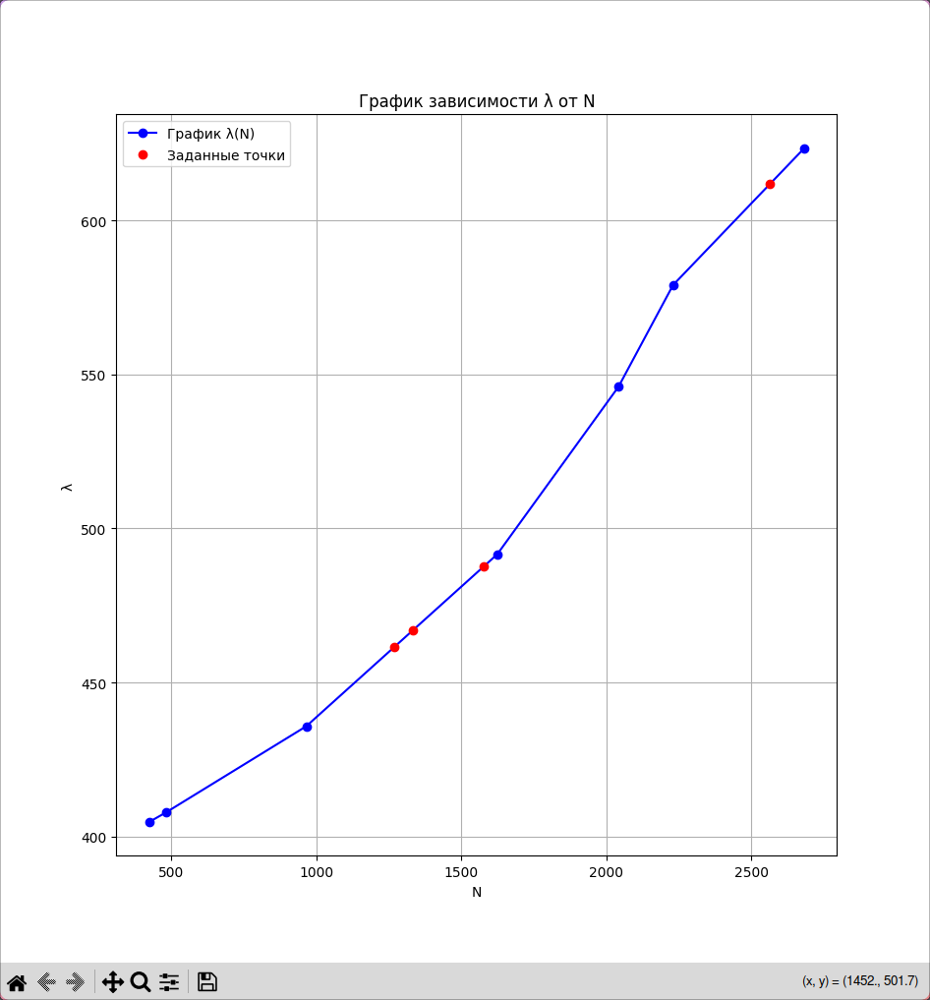

### Лабораторная работа 48

### Изучение спектра атома водорода 

### Определение постоянной Ридберга

**Цель работы:** Исследовать спектр атомарного водорода, вычислить
постоянную Ридберга

### Теоретическое введение

Изолированные атомы излучают спектр, состоящий из отдельных
спектральных линий. Линии в спектрах атомов расположены не
беспорядочно, а объединяются в группы, называемые спектральными
сериями. Каждый элемент излучает характерный только для него спектр.
Наиболее простой спектр имеет атом водорода. Длины волн его
спектральных линий с достаточной точностью могут быть рассчитаны по
формуле Бальмера:

$$\frac{1}{\lambda}=R\big(\frac{1}{n_i^2}-\frac{1}{n_j^2})$$

где $\lambda$ - длмеа волны спектральной линии,

$R$ - постоянная Ридберга,

$n_i,n_j$ - целые числа

Каждой серии спектра атома водорода соответствует свое
определенное значение $n_i$. Значения $n_j$ представляют собой
последовательный ряд целых чисел от $(n_j + 1)$ до $\infty$. Экспериментально
установлено, что спектр водорода представляет собой совокупность
спектральных серий, соответствующих значениям $n_i = 1, 2, 3, 4, 5$. Видимая
область спектра описывается серией Бальмера, для которой $n_i = 2, n_j =3, 4, 5, …$.

Для объяснения закономерностей, наблюдаемых в спектре атома
водорода, Бор выдвинул следующие постулаты.
1. Среди бесчисленного множества круговых электронных орбит,
возможных с точки зрения классической механики, осуществляются в
действительности только те орбиты, называемые стационарными,
находясь на которых электроны не испускают энергии.
Стационарными могут быть только те орбиты, на которых момент
импульса электрона принимает дискретный ряд значений:

$$mv r=nh$$
$h = \frac{h}{2\pi}$ - постоянная Планка

$m$ - масса электрона

$v$ - скорость электрона на стационарной орбите

$n$ - номер орбиты

$r$ - радиус орбиты

2. Атом излучает или поглощает энергию, если электрон переходит из
одного стационарного состояния в другое. Величина энергии
излучаемого светового кванта равна разности энергии тех
стационарных состояний, между которыми происходит переход
электрона.
$$E_j-E_i=hv$$

Применяя классическую механику к движению электрона в атоме
водорода, получим уравнение движения электрона в поле ядра:

$$\frac{mv^2}{2}=k\frac{Ze^2}{r^2};Z=1,\quad\text{где } k =\frac{1}{4\pi\varepsilon_0}=9\cdot10^9\frac{\text{м}}{\text{Ф}}$$
$e$ - заряд электрона, равный $1.6 \cdot10^{-19}\text{ Кл}$

Решая совместно уравнения (2) и (4), получим для радиусов
стационарных орбит электрона

$$r_n=n^2\frac{h^2}{kme^4},\text{ где $n$ - номер орбиты}$$

Это выражение можно записать в виде:
$$r_n=n^2r_1,\text{ где } r_1=\frac{h^2}{kme^4}=53\text{ пм - радиус первой орбиты}$$
Полная энергия электрона, равная сумме кинетической $E_k=\frac{mv^2}{2}$
и потенциальной $E_p=-k\frac{e^2}{r}$, определяется следующим выражением:
$$E_n = -\frac{1}{n^2}\cdot\frac{k^2me^4}{2h^2}$$
Следовательно, $E_n = \frac{E_1}{n^2}$, где $E_1 = -\frac{k^2me^4}{2h^2} = -13,55$ эВ - энергия
электрона на первой орбите. Таким образом, радиус и полная энергия электрона
в атоме водорода квантуются, то
есть принимают дискретный ряд значений.

На рисунке 2 приведена схема энергетических уровней атома
водорода.
Подставляя выражение (5) в (3), получаем

$$hv = \frac{k^2me^4}{2h^2}(\frac{1}{n_i^2}-\frac{1}{n^2_j})$$
 Заменив некоторые элементы ($h=\frac{h}{2\pi}$ и $v=\frac{c}{\lambda}$)
$$\frac{1}{\lambda} = \frac{k^2me^42\pi^2}{h^3c}(\frac{1}{n_i^2}-\frac{1}{n^2_j})$$
откуда постоянная Ридберга:
$$R = \frac{k^2me^42\pi^2}{h^3c}=1.097\cdot10^7 \text{м}^{-1}$$
Чем больше электронов имеет атом, тем сложнее схема его
энергетических уровней и спектр

Наиболее полно спектры излучения атомов объясняет квантовая
механика.
Теория Бора сыграла роль переходного этапа от классической физики к
квантовой теории. В основе развития квантовой механики лежали теория
Бора и гипотеза де Бройля, согласно которой всем микрочастицам, кроме
корпускулярных свойств, присущи также и волновые свойства. В квантовой
механике введена волновая функция $\psi(х, у, z, t)$, описывающая поведение
частиц в микромире.

Физический смысл имеет квадрат модуля волновой функции $|\psi|^2$,
который определяет вероятность $dW$ того, что частица находится в пределах
объема $dV$
$$dW=|\Psi|^2=\Psi\Psi'dV$$
где $\Psi'$ - функция комплексно сопряженная функции $\Psi$
Пси-функция удовлетворяет условию нормировки:

$$\int_\infty^\infty\Psi\Psi'dV=1$$
Данный интеграл дает вероятность достоверного события, так как
микрочастица находится где-то в пространстве, а интегрирование проводится
по всему пространству.
То обстоятельство, что $|\Psi|^2$ характеризует плотность вероятности
местонахождения микрочастицы, накладывает на волновую функцию
совокупность требований, называемых стандартными условиями. По
стандартным условиям функция должна быть однозначной, непрерывной,
конечной и иметь непрерывную и конечную производную.
Волновую $\Psi$ − функцию находят решая основное уравнение квантовой
механики – уравнение Шредингера:
$$-\frac{h^2}{2m}\Delta\Psi+U(x,y,z,t)\Psi=ih\frac{\delta\Psi}{\delta t}$$
где $\Delta = \frac{\delta^2}{\delta x^2} +\frac{\delta^2}{\delta y^2}+\frac{\delta^2}{\delta z^2}$ - оператор Лапласа, $m$ - масса частицы

Для стационарного состояния, когда потенциальная энергия частицы не
зависит явно от времени, то есть
$$U(x,y,z,t)=U(x,y,z)$$
$$\Psi(x,y,z,t)=\Psi(x,y,z,0)=\Psi(x,y,z)\text{ и }E=\frac{p^2}{2m}+U(x,y,z) = \text{ const}$$
система консервативна и уравнение Шредингера принимает вид:
$$\Delta\Psi+\frac{2m}{h^2}(E-U)\Psi=0$$
$$\Psi=\Psi(x,y,z)$$
Здесь Е – полная энергия частицы, 𝑈 − потенциальная энергия
частицы.
Потенциальная энергия электрона в атоме водорода равна:
$$U=-\frac{ke^2}{r}$$

и уравнение Шредингера для электрона в атоме водорода можно записать в
виде:

$$\Delta\Psi+\frac{2m}{h^2}(E+\frac{ke^2}{r})\Psi=0$$
Решая уравнение (7), мы получим, при любых положительных
значениях $Е > 0$ (что соответствует энергии электрона вне атома), энергия
свободного электрона может принимать любые значения.
При $Е < 0$, (что соответствует энергии электрона, находящегося в
поле ядра, то есть в пределах атома), решение уравнения (7) ищется в
сферических координатах. В теории дифференциальных уравнений
доказывается, что уравнение такого вида имеет решения, удовлетворяющие
условиям однозначности, конечности и непрерывности, не при любых
значениях параметра $Е$, а лишь при некоторых дискретных его значениях. В
частности,
для уравнения (7) при значениях энергии:
$$E_n=-\frac{1}{n^2}\cdot\frac{k^2me^4}{2h^2}\, n=1,2,3...$$
Это выражение в точности совпадает с выражением (5), полученным
Бором.
Кроме того, решение уравнения Шредингера в сферических
координатах определяет величину момента импульса электрона и его
проекцию на выбранное направление.
Детальный анализ показывает, что момент импульса электрона может
иметь только дискретные, квантованные значения, определяемые
орбитальным квантовым числом $l$.
При данном значении главного квантового числа $n$, орбитальное
квантовое число $l$ может принимать следующие значения:
$$l=0,1,2,3,...,(n-1)$$
Момент импульса электрона: $|L|=h\sqrt{l(l-1)}$
Проекция момента импульса электрона на выбранное направление также
принимает дискретный ряд значений, определяемых магнитным квантовым
числом $m$:
$$m=-l,-(l-1),...,-2,-1,0,1,...,(l-1),l;\text{всего }2l+1\text{ значение}$$
$$L_z = mh$$
В квантовой механике показывается, что момент импульса частицы не
может иметь определенное значение одновременное с его проекцией. Это
означает, что «вектор» момента импульса не имеет определенного
направления

Каждому значению энергии электрона в атоме водорода $E_n$ (кроме
энергии основного состояния с $n = 1$), соответствует несколько волновых
функций, отличающихся значением квантовых чисел $l$ и $m$. То есть атом
водорода может иметь одно и тоже значение энергии, находясь в нескольких
различных состояниях с разными $l$ и $m$. Эти состояния имеют разную форму
электронных облаков и/или различную их ориентацию в пространстве. Такие
уровни энергии называются вырожденными, а число различных состояний,
отвечающих одному и тому же значению энергии $E_n$, называется кратностью
вырождения энергетического уровня. Кратность вырождения энергетических
уровней атома водорода равна:

$$\sum_{i=1}^{n-1}(2l+1)=n^2$$
Состояние электрона в атоме с различными значениями орбитального
квантового числа $l$ отличаются величиной момента импульса. В атомной
физике применяются заимствованные из спектроскопии условные
обозначения состояний электрона с различными моментами импульса.
Электрон, находящийся в состоянии с $l = 0$, называются
$s$ −электроном (соответствующее состояние - $s$ −состоянием), с $l = 1$
$p$ −электроном, с $l = 2$ $d$ −электроном, с $l = 3$ $f$ −электроном и
так далее. Значение главного квантового числа указывается перед условным
обозначением квантового числа ℓ. Таким образом, электрон в состоянии с
$n = 1$ и $s = 1$ обозначается символом $1s$, с $n = 3$ и $l = 1 − 3p$ и так далее.
Поскольку $l$ всегда меньше $n$, то возможны следующие состояния
электрона:
    
    1s
    2s, 2p
    3s, 3p, 3d
    4s, 4p, 4d, 4f и т.д.

На рисунке 3 приводится схема энергетических уровней электрона в
атоме водорода с учетом возможного состояния электрона.
В квантовой механике доказывается, что возможны только те переходы
электронов из одного состояния в другое, при которых квантовое число ℓ
изменяется на единицу:

$$\Delta l = \pm1$$
Это условие называется правилом отбора.
Существование правила отбора объясняется тем, что фотон обладает
собственным моментом импульса, равным примерно ℏ. При испускании
фотон уносит из атома момент импульса, при поглощении привносит. Так
что правило отбора является следствием закона сохранения импульса

На рисунке 3 показаны переходы электрона в атоме водорода,
разрешенные правилом отбора. Пользуясь условными обозначениями
состояний электрона в атоме:
серии Лаймана соответствуют переходы $np \Rightarrow 1s, 𝑛 = 2, 3, …$.
серии Бальмера − $𝑛𝑠 \Rightarrow 2𝑝, 𝑛𝑑 \Rightarrow 2𝑝, 𝑛𝑝 \Rightarrow 2𝑠, 𝑛 = 3, 4, …$.
Состояние $1s$ является основным состоянием атома водорода. В этом
состоянии атом обладает минимальной энергией. Чтобы перевести атом из
основного состояния в возбужденное ему необходимо сообщить энергию

Плотность вероятности нахождения электрона внутри атома
определяют по значениям волновой функции $\Psi$, полученным из решения
уравнения Шредингера в сферической системе координат $\{r, \Theta, \phi\}$. Здесь $r$ −
радиус-вектор электрона, $\Theta$ − угол между осью z и радиус-вектором,
$\phi$ −азимутальный угол. Пси-функция для $s$ −состояния ($l = 0$) не зависит от
углов $\Theta$ и $\phi$, то есть является сферически симметричной: $\Psi = \Psi(𝑟)$.
Вероятность найти $s$ −электрон в тонком шаровом слое радиуса $r$ и
толщиной $dr$ равна (рис. 4):
$$dW=\Psi\Psi'dV = \Psi(r)\Psi'(r)r\pi r^2dr$$
так как $dV=4\pi r^2dr$

Выражение $\Psi(r)\Psi'(r)r\pi r^2$ представляет собой плотность вероятности
найти электрон на расстоянии $r$ от ядра.
Волновые функции $\Psi(r,\Theta,\phi)$ для $l$ отличных от нуля распадаются на
два множителя, один из которых зависит только от $r$, а другой только от
углов $\Theta$ и $\phi$. Таким образом, и в этом случае можно ввести понятие
плотности вероятности нахождения электрона на расстоянии $r$ от ядра,
подразумевая под $\psi(𝑟)$ ту часть $\psi$ −функции, которая зависит от $r$.
На рисунке 5 приведены: слева − три вида орбиталей атома водорода
для случаев: 1) $n = 1, l = 0;$ 2) $n = 2, l = 0;$ 3) $n = 3, l = 0;$ справа −
зависимости плотности вероятности нахождения электрона от расстояния до
ядра.
Таким образом, если в квантовой механике теряется представление об
орбите или траектории электрона, то имеется вероятность обнаружить
электрон ближе или дальше от ядра. Чем больше главное квантовое число 𝑛,
тем на большем расстоянии от ядра находится максимум вероятности
обнаружить электрон.

### Экспериментальная часть
#### Методика эксперимента

В работе с помощью универсального монохроматора УМ-2 наблюдают
спектры газов в видимой области.
1. Градуируют спектроскоп по известному спектру ртути.
2. Измеряют длины волн в спектре атома водорода.
3. По измеренным длинам волн в спектре водорода определяют уровни
энергии электронов, при переходах между которыми испускаются
кванты света. Определяются соответствующие этим уровням
квантовые числа $n_i$ и $n_j$, далее вычисляют постоянную Ридберга.

**Приборы и принадлежности:** 1. Универсальный монохроматор УМ-2. 2.
Ртутная лампа. 3. Водородная лампа. 4. Пусковое устройство для ртутной и
водородной ламп.
Порядок включения и правила работы с ртутной и водородной лампами
описаны в инструкции на рабочем месте. Схема монохроматора УМ-2 и
правила работы с ним также имеются на рабочем месте.

Следует помнить, что в установке используется опасное для жизни
высокое напряжение, поэтому необходимо проверить целостность всех
проводов перед включением!

Задание 1. Градуирование шкалы монохроматора
1. Включить монохроматор.
2. Расположить выходное отверстие ртутной лампы против объектива
монохроматора. Включить ртутную лампу.
3. Наблюдая спектр и вращая барабан монохроматора, совместить визир
(острие) с линией спектра и произвести считывание показание
монохроматора (в делениях барабана).
4. По барабану монохроматора провести измерения положения всех
линий спектра ртути. Результаты измерений занести в таблицу 1.

| № п/п | Окраска линии    | Относительная яркость | Длина волны (нм) | Число делений монохроматора |
|-------|------------------|-----------------------|------------------|-----------------------------|
| 1     | Красная          | 10                    | 623,4            | 2682                       |
| 2     | Желтая           | 10                    | 579,0            | 2230                        |
| 3     | Зеленая яркая    | 12                    | 546,0            | 2042                        |
| 4     | Зелено-голубая   | 7                     | 491,6            | 1624                        |
| 5     | Синяя            | 8                     | 435,8            | 966                         |
| 6     | Фиолетовая 1-я   | 6                     | 407,8            | 482                         |
| 7     | Фиолетовая 2-я   | 8                     | 404,7            | 424                         |

5. По окончании измерений выключить ртутную лампу.
6. Пользуясь полученными данными, построить градуировочный график
(вручную или используя возможности специальных программ
построения графиков). По оси абсцисс отложить число делений
барабана монохроматора, по оси ординат – длины волн наблюдаемых
спектральных линий ртути.

Задание 2. Измерение длин волн спектра атома водовода
1. Расположить выходное отверстие водородной лампы против объектива
монохроматора. Включить водородную лампу.
2. Наблюдая спектр и вращая барабан монохроматора, совместить визир
(острие) с линией спектра и произвести считывание показание
монохроматора (в делениях барабана).
3. По барабану монохроматора провести измерения положения всех
линий спектра водорода. Результаты измерений занести в таблицу 2

| № п/п | Окраска линии    | Число$\\$ делений моно-$\\$хроматора | Длина $\\$ волны по градуи- $\\$ровочному графику (нм) | $\Delta E$, эВ | $n_i$ и $n_j$ | Постоянная Ридберга, $м^{-1}$ |
|-------|------------------|-----------------------------|---------------------------------------------|--------|-------------------|--------------------------|
| 1     |  красная         |    2564                     |   611.81                                          | 2.03       |  2 3                |   $1.17\cdot 10^7 м^{-1}$                       |
| 2     |  зелено          |    1576                     |   487.53                                          | 2.54       |  2 4                |   $1.09\cdot 10^7 м^{-1}$                    |
| 3     |  синяя           |    1332                     |   466.84                                          | 2.66       |  2 5                |   $1.02\cdot 10^7 м^{-1}$                    |
| 4     |  фиолетовая      |    1268                     |   461.41                                          | 2.69       |  2 6                |   $0.97\cdot 10^7 м^{-1}$                    |

4. По градуировочному графику определить длины волн измеренных
линий атома водорода и результаты занести в таблицу 2.

Задание 3. Исследование спектра атома водовода в видимой области
1. По полученным значениям длин волн линий в спектре водорода
вычислить энергию фотонов, соответствующую этим линиям:
$$\Delta E=hv=h\frac{c}{\lambda}$$
2. По схеме энергетических уровней атома водорода (рисунок 1) найти
уровни энергии, при переходах между которыми испускаются линии
спектра; определить соответствующие этим уровням квантовые числа
($n_i, n_j$) и занести результаты в таблицу 2.
3. По формуле (1), используя полученные значения длин волн и
квантовые числа ($n_i, n_j$), вычислить постоянную Ридберга для каждой
линии спектра атома водорода. Найти среднее значение постоянной
Ридберга. Сравнить полученное экспериментально значение с
теоретическим значением, вычисленным по формуле (6).

### КОНТРОЛЬНЫЕ ВОПРОСЫ (2 курс 2 модуль)

1. **В чем ньютоновская механика противоречит квантовой механике?**  
   Ньютоновская механика предполагает движение частиц по определённым траекториям, тогда как квантовая механика оперирует вероятностями нахождения частиц в пространстве. В квантовой механике понятие траектории заменяется волновой функцией, а движения частиц квантуются.

2. **Запишите стационарное уравнение Шредингера для атома водорода. Почему наиболее подходящей координатной системой для рассмотрения атома водорода является сферическая?**  
   $$\Delta \Psi + \frac{2m}{\hbar^2}(E + \frac{ke^2}{r})\Psi = 0.$$  
   Сферическая система координат используется, так как потенциальная энергия электрона в атоме водорода зависит только от расстояния до ядра ($r$), что соответствует сферической симметрии.

3. **Проанализируйте (качественно) ход решения стационарного уравнения Шредингера для атома водорода в сферических координатах. Какие выводы следуют из его решения?**  
   Решение уравнения Шредингера приводит к квантуемым значениям энергии $E_n$ и орбитального момента $L$. Получаются три квантовых числа: главное $n$, орбитальное $\ell$ и магнитное $m_\ell$. Решение подтверждает дискретность энергетических уровней и моментов импульса.

4. **Запишите собственные значения энергии электрона в атоме водорода, определяемые решением уравнения Шредингера, и проанализируйте их. В чем отличие и сходство с результатами теории Бора?**  
   $$E_n = -\frac{1}{n^2} \frac{k^2 m e^4}{2\hbar^2}, \, n = 1, 2, 3, \dots$$  
   Совпадает с результатами теории Бора, но в квантовой механике добавляются орбитальные и магнитные квантовые числа.

5. **Чему равна кратность вырождения состояния, соответствующего n = 3?**  
   Кратность вырождения равна $n^2 = 3^2 = 9$.

6. **Какие величины для электрона в атоме определены, если известны квантовые числа n, ℓ и 𝑚ℓ?**  
   Определены: энергия ($E_n$), орбитальный момент ($\ell$) и проекция орбитального момента на ось $z$ ($m_\ell$).

7. **Почему квантовая механика не использует представление об электронных орбитах? Что характеризуют квантовые числа n, ℓ и 𝑚ℓ?**  
   В квантовой механике отсутствует понятие орбиты из-за принципа неопределённости. Квантовые числа $n$, $\ell$, и $m_\ell$ характеризуют:  
   - $n$ – энергию,  
   - $\ell$ – орбитальный момент,  
   - $m_\ell$ – проекцию орбитального момента.

8. **Какие величины, характеризующие электрон в атоме водорода, квантуются? Запишите соответствующие формулы.**  
   - Энергия: $E_n = -\frac{k^2 m e^4}{2\hbar^2 n^2}$,  
   - Орбитальный момент: $L = \hbar \sqrt{\ell (\ell + 1)}$,  
   - Проекция орбитального момента: $L_z = m_\ell \hbar$.

9. **Представьте символическую запись электронов в состояниях с:**  
   1) $n = 3, \ell = 0, 1$: $3s, 3p$;  
   2) $n = 4, \ell = 2$: $4d$;  
   3) $n = 2, \ell = 1$: $2p$.

10. **Каков физический смысл распределения плотности заряда в электронном облаке?**  
    Плотность заряда описывает вероятность нахождения электрона в определённой области пространства.

11. **Сформулируйте правила отбора орбитального и магнитного квантовых чисел. Всегда ли они выполняются? Как может изменяться главное квантовое число?**  
    Правила отбора:  
    - $\Delta \ell = \pm 1$,  
    - $\Delta m_\ell = 0, \pm 1$.  
    Главное квантовое число может изменяться на любое значение при переходах между уровнями.

12. **Какие переходы соответствуют серии Пашена? Используйте символическую запись состояний.**  
    Переходы: $n \to 3$, например $4s \to 3p$, $5d \to 3p$.

13. **Запишите уравнение Шредингера для 1S-состояния электрона в атоме водорода и решите его. Прокомментируйте значения для а и Е. Каков квантово-механический смысл первого боровского радиуса?**  
    $E_1 = -13.55$ эВ; первый боровский радиус $r_1 = 53$ пм – среднее расстояние до ядра для основного состояния.

14. **Нарисуйте и объясните направления орбитальных механического и магнитного моментов.**  
    Орбитальный момент направлен перпендикулярно плоскости орбиты электрона, а магнитный момент противоположен из-за отрицательного заряда.

15. **Запишите выражение для модуля орбитального магнитного момента.**  
    $|\vec{\mu}_L| = \frac{e\hbar}{2m_e} \sqrt{\ell (\ell + 1)}$.

16. **Какие значения может принимать проекция орбитального магнитного момента на заданное направление? Что представляет собой магнетон Бора?**  
    Проекция: $L_z = m_\ell \hbar$, где $m_\ell = -\ell, \dots, \ell$. Магнетон Бора: $\mu_B = \frac{e\hbar}{2m_e}$.

17. **Чему равно отношение проекций орбитальных магнитного и механического моментов электрона на произвольную ось z?**  
    Отношение: $\frac{\mu_z}{L_z} = \frac{e}{2m_e}$.

18. **Что называется спином электрона? Запишите закон квантования спина электрона.**  
    Спин – собственный момент импульса электрона. Закон: $S = \hbar \sqrt{s(s + 1)}, s = 1/2$.

19. **Чему равен модуль спинового магнитного момента электрона? Почему наряду с другими квантовыми числами обычно используется магнитное спиновое квантовое число, а не спиновое квантовое число?**  
    Модуль: $|\mu_s| = \frac{e\hbar}{2m_e} \sqrt{\frac{3}{4}}$. Магнитное спиновое число $m_s = \pm 1/2$ используется, так как проекция спина на ось имеет определённые значения.

## Вывод

В этой лабораторной работе мы исследовали спектр атомарного водорода
и вычислили постоянную Ридберга экспериментальным путем. По итогам
полученная постоянная Ридберга близка к настоящей

