- [Понятие энтропии случайной величины. Основные свойства энтропии (верхняя и нижняя оценки на величину энтропии дискретной СВ)](#1)  
- [Понятие Hq(U) и связь H(U), U~p и Hq(U)](#2)
- [Условная энтропия и дивергенция Кульбака-Лейбнера. Свойства условной энтропии](#3)
- [Совместная энтропия. Энтропия системы независимых СВ. Свойства совместной энтропии.](#4)
- [Понятие взаимной информации.](#5)
- [Базовые свойства взаимной информации.](#6)
- [Выпуклость дивергенций Кульбака-Лейбнера](#7)
- [Закон больших чисел](#8)
- [AEP теорема](#9)
- [Определение типичного множества. Основные свойства типичных множеств](#10)
- [Мощность типичного множества](#11)
- [Теорема о вероятности типичного множества](#12)
- [Теорема Шеннона о кодировании источника](#13)
- [Понятие высоковероятного множества. Связь типичного множества и высоковероятного множества.](#14)
- [Понятие префиксного и однозначно-декодируемого кода. Связь между этими понятиями](#15)
- [Кодирование источника с диадическим распределением](#16)
- [Свойства диадического распределения](#17)
- [Коды Шеннона](#18)
- [Неравенство Крафта](#19)
- [Коды Хаффмана. Оптимальность кодов Хаффмана](#20)
- [Понятие кодовой схемы. Достижимая скорость передачи кодовой схемы.](#21)
- [Пропускная способность канала. Примеры](#22)

# 1
1. Понятие энтропии случайной величины. Основные свойства энтропии (верхняя и нижняя оценки на величину энтропии дискретной СВ)

# 2
2. Понятие Hq(U) и связь H(U), U~p и Hq(U)

# 3
3. Условная энтропия и дивергенция Кульбака-Лейбнера. Свойства условной энтропии

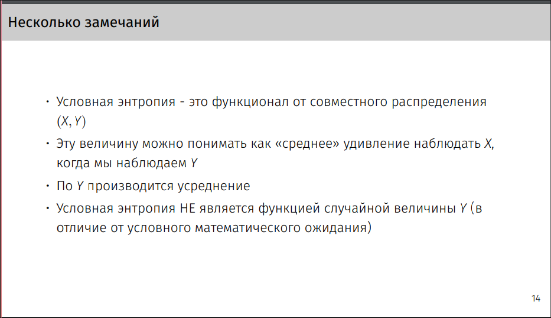

# 4
4. Совместная энтропия. Энтропия системы независимых СВ. Свойства совместной энтропии.
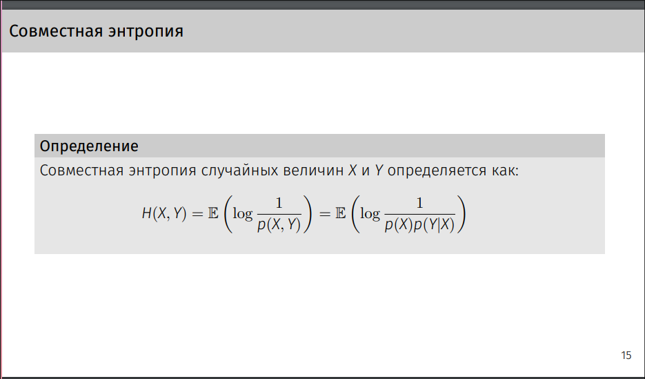
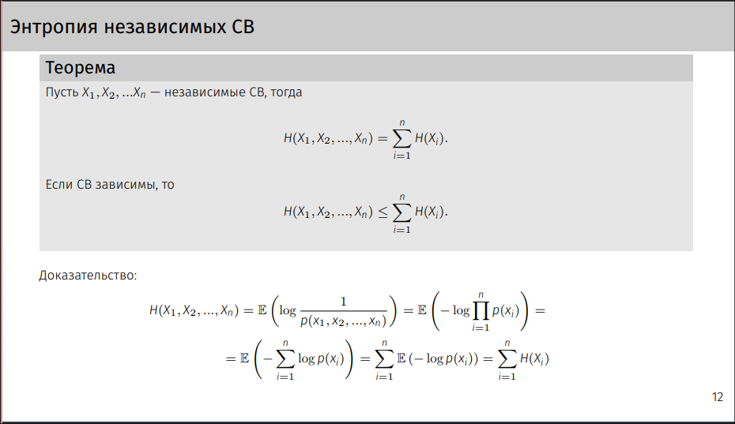
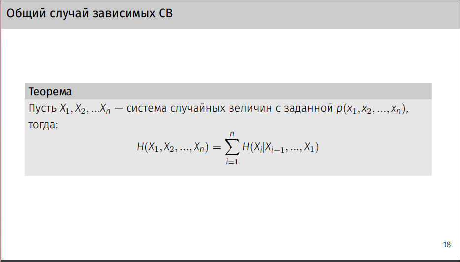

# 5
5. Понятие взаимной информации.
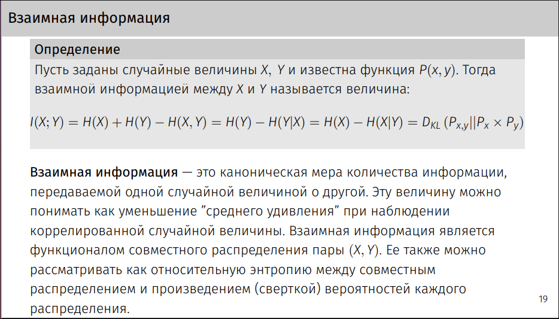
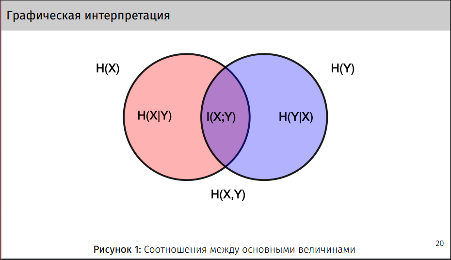

# 6
6. Базовые свойства взаимной информации.
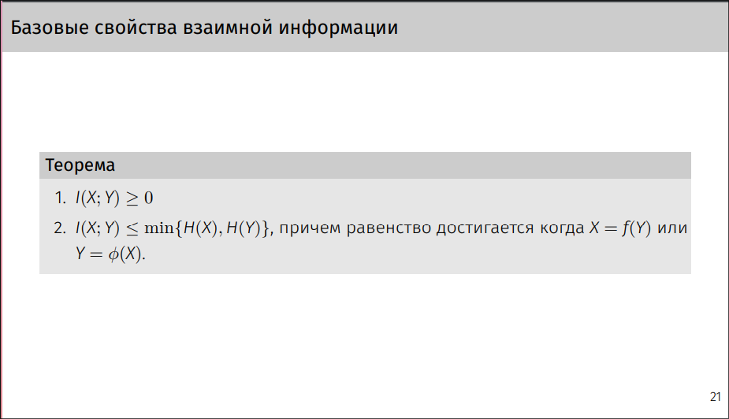

# 7 
7. Выпуклость дивергенций Кульбака-Лейбнера

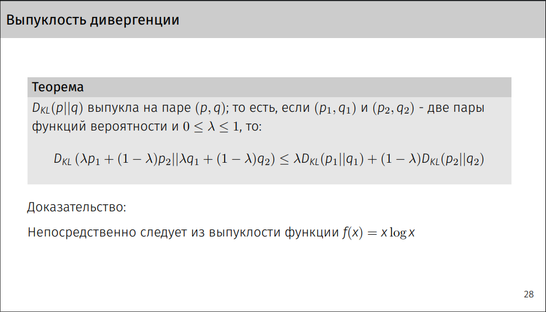

# 8
8. Закон больших чисел
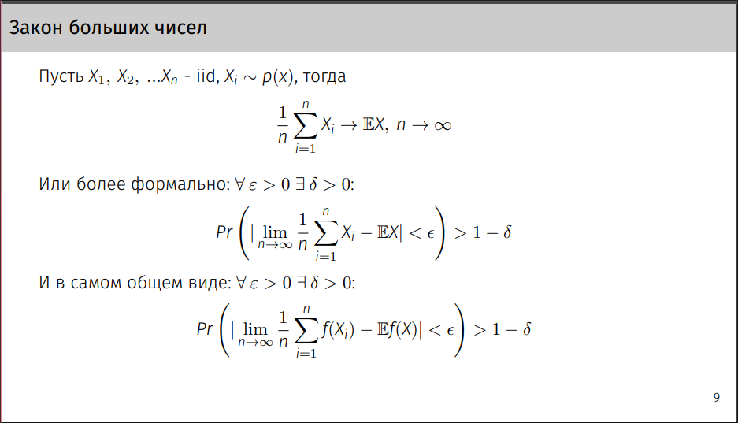

# 9
9. AEP теорема
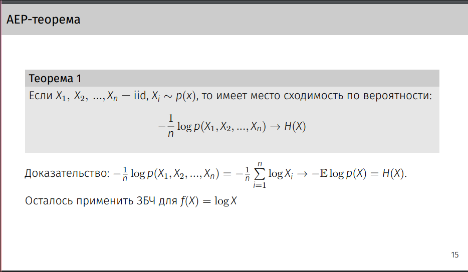

# 10
10. Определение типичного множества. Основные свойства типичных множеств
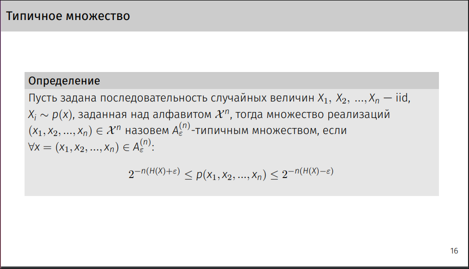
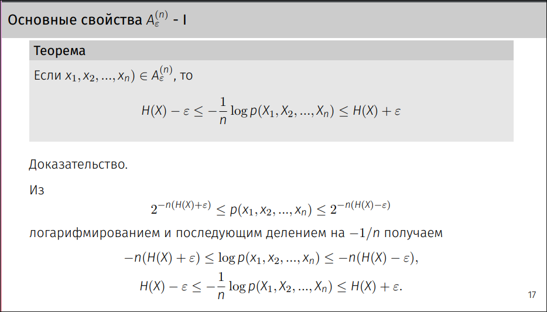
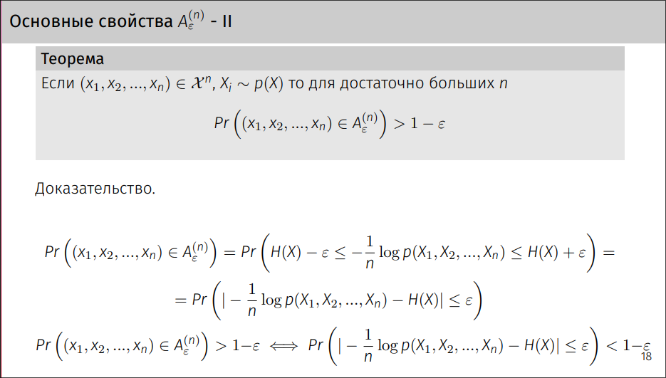
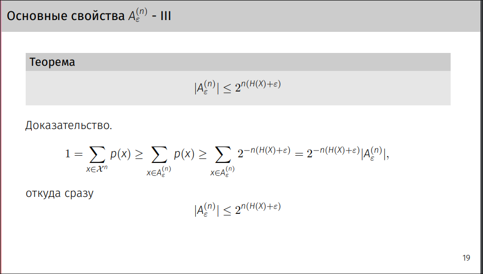
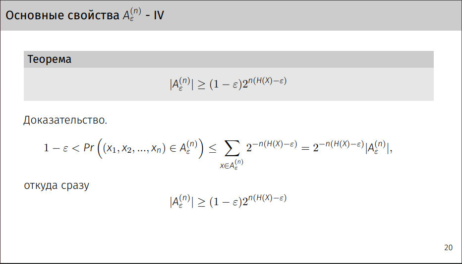
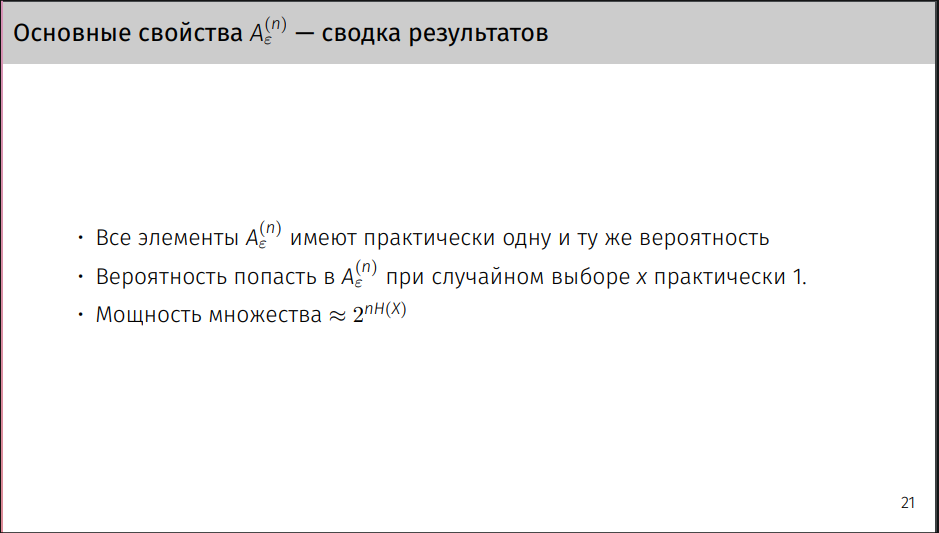

# 11
11. Мощность типичного множества

# 12
12. Теорема о вероятности типичного множества

# 13
13. Теорема Шеннона о кодировании источника

# 14
14. Понятие высоковероятного множества. Связь типичного множества и высоковероятного множества.

# 15
15. Понятие префиксного и однозначно-декодируемого кода. Связь между этими понятиями

# 16
16. Кодирование источника с диадическим распределением

# 17
17. Свойства диадического распределения

# 18
18. Коды Шеннона

# 19
19. Неравенство Крафта

# 20
20. Коды Хаффмана. Оптимальность кодов Хаффмана

# 21
21. Понятие кодовой схемы. Достижимая скорость передачи кодовой схемы.

# 22
22. Пропускная способность канала. Примеры

