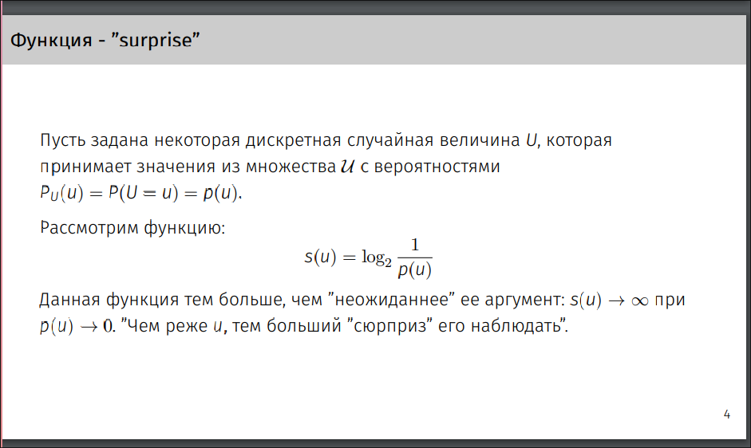
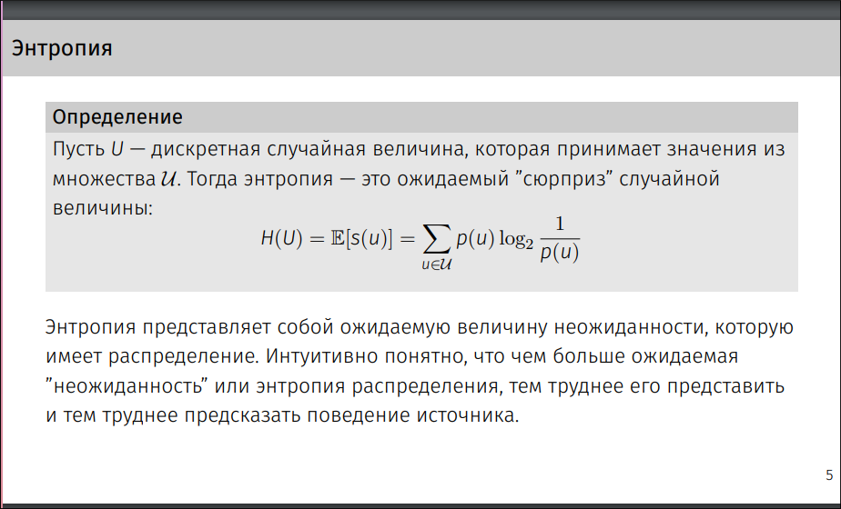
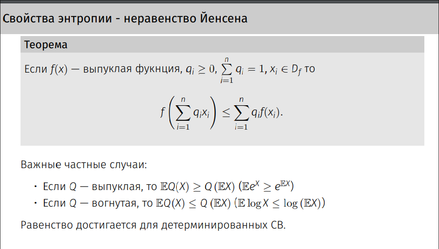
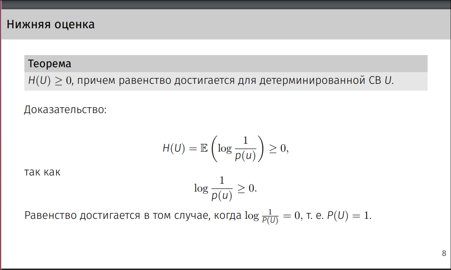
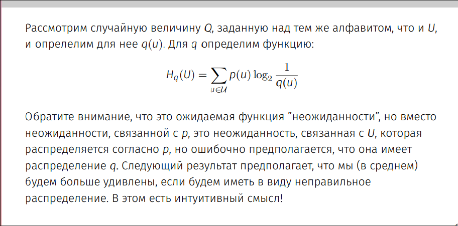
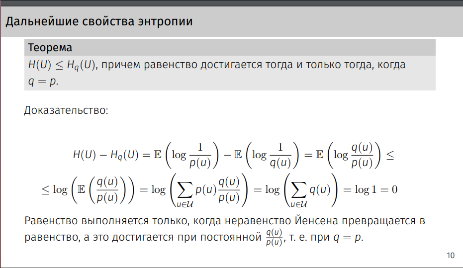

[1](#1)  
[2](#2)

# 1
1. Понятие энтропии случайной величины. Основные свойства энтропии (верхняя и нижняя оценки на величину энтропии дискретной СВ)

# 2
2. Понятие Hq(U) и связь H(U), U~p и Hq(U)

