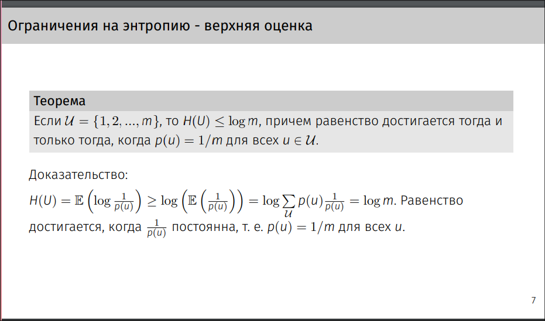
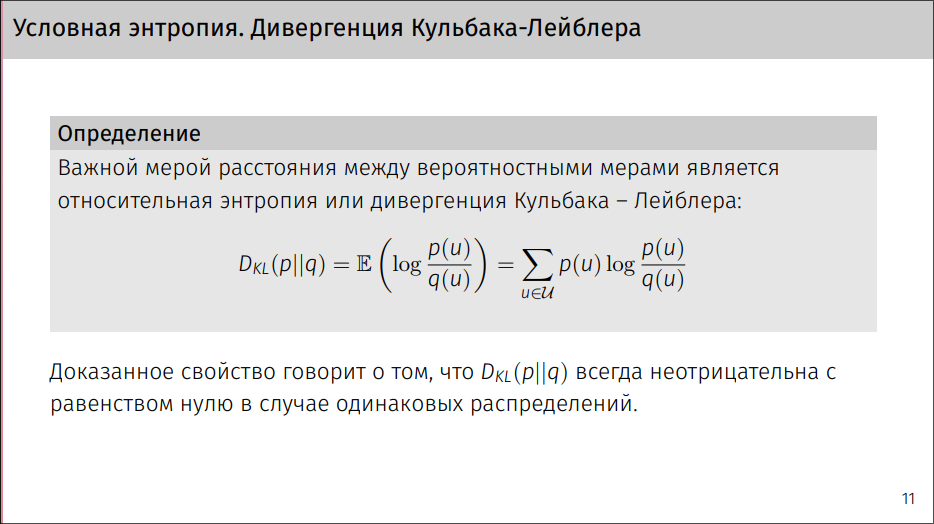
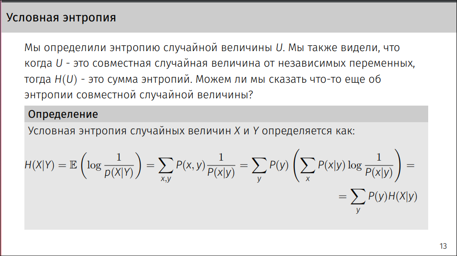

- [Понятие энтропии случайной величины. Основные свойства энтропии (верхняя и нижняя оценки на величину энтропии дискретной СВ)](#1)  
- [Понятие Hq(U) и связь H(U), U~p и Hq(U)](#2)
- [Условная энтропия и дивергенция Кульбака-Лейбнера. Свойства условной энтропии](#3)
- [Совместная энтропия. Энтропия системы независимых СВ. Свойства совместной энтропии.](#4)
- [Понятие взаимной информации.](#5)
- [Базовые свойства взаимной информации.](#6)
- 
- 
- 
- 
- 
- 
- 
- 
- 
- 
- 
- 
- 
- 

# 1
1. Понятие энтропии случайной величины. Основные свойства энтропии (верхняя и нижняя оценки на величину энтропии дискретной СВ)

# 2
2. Понятие Hq(U) и связь H(U), U~p и Hq(U)

# 3
3. Условная энтропия и дивергенция Кульбака-Лейбнера. Свойства условной энтропии

# 4
4. Совместная энтропия. Энтропия системы независимых СВ. Свойства совместной энтропии.

# 5
5. Понятие взаимной информации.

# 6
6. Базовые свойства взаимной информации.

